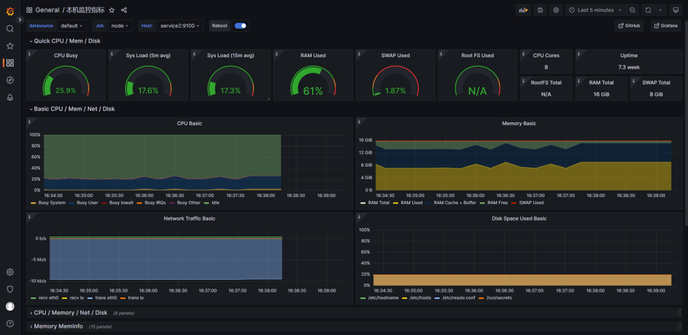
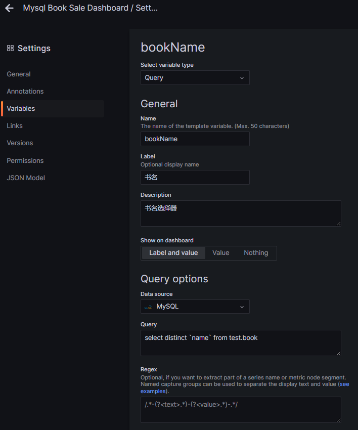
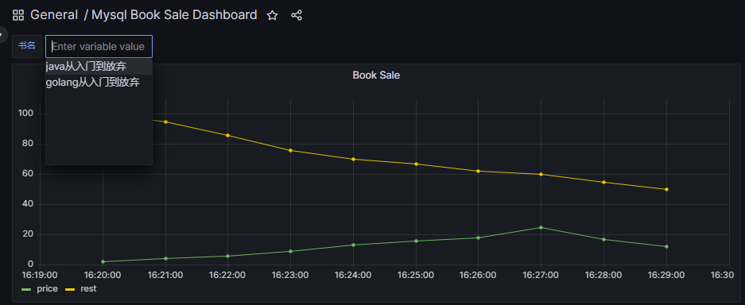
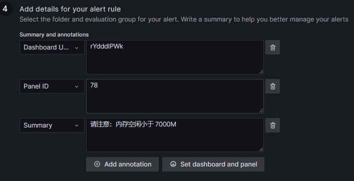
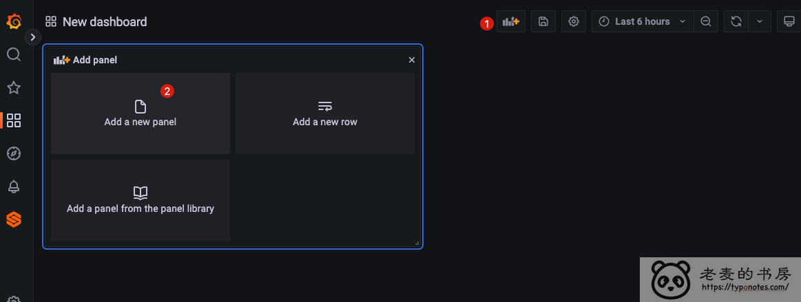
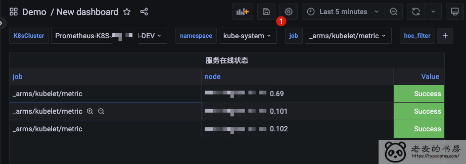
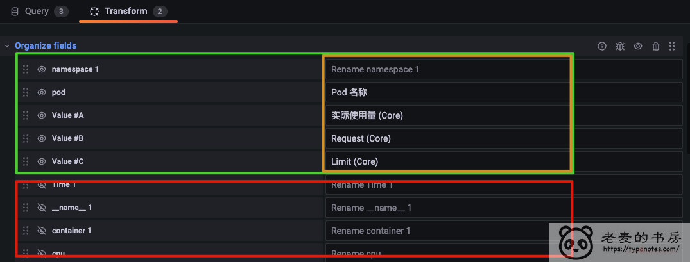

[toc]


# 一、Grafana初识

**监控的学习内容主要是当前流行的Grafana+Prometheus+Alertmanager。**

对于监控这个系列的内容，主要是学习怎么用，不会像解析Spring源码，各种原理之类的那么晦涩难懂。


这个东西我们学会了，那就是会了！加油！道友！

## 1.1 概述

无论在什么时候，什么场景，什么地点，貌似都离不开监控，甚至是你上班都在考虑着有没有什么东西监控着你。看吧，即便是在普通的世界里监控已是如此的重要，那在IT的世界里，监控更是重中之重。

版本号

当前学习的Grafana版本号为`v9.4.3(cf0a135595)`如图所示：


grafana_version.png

Grafana是啥

Grafana 是一个**监控仪表系统**，它是由 Grafana Labs 公司开源的的一个系统监测 (System Monitoring) 工具。它可以大大帮助你简化监控的复杂度，**你只需要提供你需要监控的数据，它就可以帮你生成各种可视化仪表。同时它还有报警功能，可以在系统出现问题时通知你**。

基本概念

**Data Source**：grafana确切地说是一个前端展示工具，将数据以非常美观直接的图形展示出来。那么这些数据必须有 一个来源吧，grafana获取数据的地方就称为Data Source。

**DashBoard**：仪表盘，就像汽车仪表盘一样可以展示很多信息，包括车速，水箱温度等。Grafana的DashBoard就 是以各种图形的方式来展示从Datasource拿到的数据。

**Row**：DashBoard的基本组成单元，一个DashBoard可以包含很多个row。一个row可以展示一种信息或者多种信息的组 合，比如系统内存使用率，CPU五分钟及十分钟平均负载等。

**Query Editor**：用来指定获取哪一部分数据。类似于sql查询语句，比如你要在某个row里面展示test这张表的数据， 那么Query Editor里面就可以写成select *from test。这只是一种比方，实际上每个DataSource获取数据的方式都不 一样，所以写法也不一样，比如像zabbix，数据是以指定某个监控项的方式来获取的。

**Organization**：org是一个很大的概念，每个用户可以拥有多个org，grafana有一个默认的main org。用户登录后可以 在不同的org之间切换，前提是该用户拥有多个org。不同的org之间完全不一样，包括datasource，dashboard等都不 一样。创建一个org就相当于开了一个全新的视图，所有的datasource，dashboard等都要再重新开始创建。

**User**：这个概念应该很简单，不用多说。Grafana里面用户有三种角色admin,editor,viewer。admin权限最高，可以 执行任何操作，包括创建用户，新增Datasource，创建DashBoard。在2.1版本及之后新增了一种角色read only  editor（只读编辑模式），这种模式允许用户修改DashBoard，但是不允许保存。每个user可以拥有多个 organization。

## 1.2 数据源

**Grafana支持以时间序列存储数据的相关数据源，每个数据源都有一个特定的查询编辑器**，该编辑器针对特定数据源公开的功能进行自定义。

Grafana默认支持以下数据源：Graphite、InfluxDB、OpenTSDB、Promethenus、Elasticsearch、CloudWatch等数据源，如果在`Add data source`页面没有想要的数据源，也可以滑到最底部，点击`find more data source plugins from grafana.com`去到插件官网去下载支持对应数据源的插件。

不同的数据源的查询语言和功能是不同的，Grafana可以将不同的数据合并到单个Dashboard中。但每个面板都要与属于特定`Org`(看基本概念)的数据源相关联。换句话说就是每个panel只能使用属于当前组织的数据源

**本文将以目前流行的Prometheus作为数据源为例进行接入**。

## 1.3 架构图

以Promemtheus作为数据源，架构图如下所示:


如图所示：

1. 最左边的一列是我们需要进行监控的对象，如Linux，Mysql，Redis，Container等。
2. 虚线框中的是针对不同的监控对象，由prometheus提供的对应的Exporter。不同的监控对对象由不同的Exporter采集对应的metrics，相当于一个agent。
3. Exporter采集到指标，并提供统一的接口，Promethus主动进行接口的调用，采集Exporter的数据，进行存储。
4. grafana对接Prometheus作为数据源，针对不同的数据类型，图形化展示对应的指标数据。
5. Alert告警功能，可以针对某一个仪表盘设置告警的条件。

prometheus提供了很多的Exptoter。具体种类请参考以下网址。

```
https://prometheus.io/docs/instrumenting/exporters
```

## 1.4 Grafana 工作原理

Grafana 是一个监控仪表盘，而仪表盘必然就是用来展示数据的。但是Grafana 本身并不对数据源进行假设，它只是针对不同的数据源，提供了查询对应的数据源的能力，让它可以获取到来自不同数据源的数据。如 Prometheus，**数据源才是负责存储和查询数据的**。

也就是说，Grafana 每次要展现一个仪表盘的时候，会向 Prometheus 发送一个查询请求。

> 仪表盘

在 Grafana 里，仪表盘的配置可以通过图形化界面进行，但配置好的仪表盘是以 JSON 存储的。这也就是说，**一个仪表盘就是一份json数据，这份json数据就包含这个仪表盘的一些信息，告诉仪表盘这个数据该怎么展示，比如是折线图还是柱状图，绘图的数据的提取方式等信息**。

也就是说当你使用别个做好的仪表盘时，你实际上只是导入了描述这个仪表盘的json信息。

以下是Grafana 的仪表盘市场：

```
https://grafana.com/grafana/dashboards
```

比如说针对以下一些服务的标准仪表盘就可以在这里找到

- JVM
- Spring Boot
- MySQL 监控

如果没有喜欢的仪表盘，也可以通过自定义的方式，自行去创建自定义的仪表盘。

## 1.5 接入准备

为了安装和管理方便，本次操作全部以容器方式运行，用到容器工具`Docker`，以及容器编排工具`docker-compose`.

文件清单

由于容器在被删除后，信息会丢失，所以一些重要的配置文件，以及数据文件会以卷的方式挂载进容器，以便容器被删除之后，重新启动后依然能够恢复删除之前的状态。

```
docker-compose.yml: docker-compose文件
grafana.ini: grafana配置文件
prometheus.yml: prometheus配置文件
```

文件明细

> docker-compose.yml

```
version:'3.4'
services:
  prometheus:
    image:prom/prometheus
    container_name:prometheus
    hostname:prometheus
    ports:
      -9090:9090
    volumes:
      -./prometheus.yml:/etc/prometheus/prometheus.yml
  prometheus-exporter:
    image:prom/node-exporter
    container_name:service
    hostname:service
    ports:
      -9100:9100
  grafana:
    user:root## root 身份启动，防止挂载的数据目录无权限
    image:grafana/grafana
    container_name:grafana
    hostname:grafana
    ports:
      -3000:3000
    volumes:
      -./grafana.ini:/etc/grafana/grafana.ini
      -./data/grafana:/var/lib/grafana## 数据目录
```

该文件为docker-compose的配置文件，定义所需要的服务，以及其用到的镜像，和其他一些配置。

其中使用到的镜像，都可以在对应的官方网站找到，没有版本号，默认拉取最新image。

`prom/prometheus`: Prometheus的镜像，用来作为Grafana的数据源。

`prom/node-exporter`: Prometheus提供的一个监控主机数据的Exporter，比如CPU，内存，磁盘，网卡等信息。用于向Prometheus提供数据(实际上数据还是由Prometheus主动拉取的)。

`grafana/grafana`:Grafana镜像，用于启动Grafana服务。

> prometheus.yml

```
global:
  scrape_interval:10s

scrape_configs:
-job_name:node
  static_configs:
  -targets:['service:9100']
  
# - job_name: cAdviser
#   static_configs:
#   - targets: ['cAdviser:9200']
```

prometheus的配置文件，每一个不同Exporter都对应着一条一条的`scrape_configs.job_name`的配置。比如我注释掉的部分。targets代表的就是不同Exporter对象暴露出来的获取指标数据的地址。比如Node Exporter的服务端口就是9100，cAdviser Exporter的服务端口是9200，Prometheus通过这个端口，向对应的Exporter服务发起调用，获取监控数据。

> grafana.ini

本次测试该文件为空。

在`docker-compose.yml`配置文件下，启动所有容器，就可以开始装逼了。

```
$ docker-compose up -d
```

检查

> Grafana
>
> http://192.168.2.13:3000/

访问网址，正常出页面就ok

> Node-Exporter
>
> http://192.268.2.13:9100/metrics

访问网址，返回所有指标，则说明服务正常

> prometheus
>
> http://192.168.2.13:9090/

访问网址，页面能打开。访问`status->targets`可以看到配置的所有内容。并且所有的监控项`State`都为`UP`，如果不是UP，那说明Node-Exporter启动有问题，或者网络不通。


# 二、 数据源接入

## 2.1 Prometheus

在grafana主界面-->添加数据源-->选择Prometheus. 进入prometheus数据源添加界面。填写连接prometheus的地址,其他默认就好。


data_source_prometheus.png

配置之后，直接点保存，就为`Grafana`添加了一个`Prometheus`的数据源。

**标准仪表盘**

针对Node-Expoter，在Grafana的仪表盘库中已经有很多标准的仪表盘了，直接再进入仪表盘的库，选择一个标准的表盘就好。

选好仪表盘之后，有个仪表盘的`id`,我们用这个`id`就可以把仪表盘导入。我这里用`id=1860`这个仪表盘。


load之后会进入到配置界面。


dashboard_load_config.png

```
Name: 仪表盘的名字，自定义即可
Folder: 放在那个文件夹下，文件夹需要在设置里面配置
UID: Dashboard唯一ID, 确定Dashboard的唯一性，可以自定义，不重复就行
prometheus: 选择一个已经添加的prometheus的数据源
```

填写好相关信息后，点击`Import`，仪表盘就建好了，会直接跳转到仪表盘的页面，有图有真相:



就这样，第一个仪表盘就算是做好了，大家也算是认识了~


# 三、仪表盘配置

开始之前，先来看看我们之前导入的仪表盘(`id=1860`)的信息。

## 3.1 Prometheus

Load的仪表盘(1860)


1860_cpu_basic.png

`id=1860`的仪表盘，有一个`CPU Basic`的`Panel`。点一下`Edit`进入到编辑界面。


1860_cpu_panel_edit.png

编辑界面如图所示(未截全的，太大了 )，图中下方`Query`tab页就是我们定义展示指标算法的地方。其中一条查询语句如下：

```
sum by(instance) (irate(node_cpu_seconds_total{instance="$node",job="$job", mode="system"}[$__rate_interval])) / on(instance) group_left sum by (instance)((irate(node_cpu_seconds_total{instance="$node",job="$job"}[$__rate_interval])))
```

这个就是Prometheus专用的查询语言，叫做`PromQL`.

## 3.2 PromQL

重点部分copy一遍，**Grafana支持以时间序列存储数据的相关数据源，每个数据源都有一个特定的查询编辑器，该编辑器针对特定数据源公开的功能进行自定义**。

Prometheus作为一个数据源，也有它自己的查询方式，这种方式就是Prometheus特定的查询语言`PromQL`。具体细节请参考官方网站或者其他资料。这坨我也就不过多赘述了，毕竟这种查询语言啥的，咱也没有那150分语文的功底，各位道友就自己去看吧！

```
https://prometheus.io/docs/prometheus/latest/querying/basics/
```

## 3.3 添加Mysql数据源

为了容易理解，我将以Mysql为数据源接入，来进行自定义面板的入门级操作。

首先第一件事就是要添加Mysql数据源。由于已经操作过添加Prometheus为数据源了，所以添加Mysql数据源这个操作就显得非常简单了。

直接在数据源添加页面，选择Mysql，进去输入连接地址，用户名，密码，库名等信息，保存就ok。


## 3.4 正片

自定义面板内容:

*从book表中，根据不同的书籍类型，在对应时间段，展示书籍价格，以及剩余数量的折线图*

### 数据初始化

```
CREATE TABLE `book` (
  `id`bigint unsigned NOT NULL AUTO_INCREMENT,
  `name`varchar(100) DEFAULT NULL COMMENT '名称',
  `update_time`timestamp NOT NULL DEFAULT CURRENT_TIMESTAMP COMMENT '时间',
  `price`int unsigned DEFAULT '0' COMMENT '价格',
  `rest`int unsigned DEFAULT '0' COMMENT '剩余数量',
  PRIMARY KEY (`id`)
) ENGINE=InnoDB;
INSERT INTO book 
(name, update_time, price, rest) 
VALUES
('java从入门到放弃', '2023-03-21 16:20:00', 2, 100),
('java从入门到放弃', '2023-03-21 16:21:00', 4, 95),
('java从入门到放弃', '2023-03-21 16:22:00', 6, 86),
('java从入门到放弃', '2023-03-21 16:23:00', 9, 76),
('java从入门到放弃', '2023-03-21 16:24:00', 13, 70),
('java从入门到放弃', '2023-03-21 16:25:00', 16, 67),
('java从入门到放弃', '2023-03-21 16:26:00', 18, 62),
('java从入门到放弃', '2023-03-21 16:27:00', 25, 60),
('java从入门到放弃', '2023-03-21 16:28:00', 17, 55),
('java从入门到放弃', '2023-03-21 16:29:00', 12, 50),
('golang从入门到放弃', '2023-03-21 16:20:00', 3, 100),
('golang从入门到放弃', '2023-03-21 16:21:00', 6, 90),
('golang从入门到放弃', '2023-03-21 16:22:00', 7, 80),
('golang从入门到放弃', '2023-03-21 16:23:00', 9, 75),
('golang从入门到放弃', '2023-03-21 16:24:00', 12, 70),
('golang从入门到放弃', '2023-03-21 16:25:00', 13, 67),
('golang从入门到放弃', '2023-03-21 16:26:00', 23, 62),
('golang从入门到放弃', '2023-03-21 16:27:00', 25, 55),
('golang从入门到放弃', '2023-03-21 16:28:00', 17, 40),
('golang从入门到放弃', '2023-03-21 16:29:00', 12, 35);
```

### 新建Dashboard/Panel

点击菜单`Dashboard-->New dashboard`进入到图示右侧的添加面板页。


上图右侧有三个选项

```
Add a new panel: 添加一个新的面板
Add a new row: 添加一行, 这个添加之后，就可以把相似的一组面板都放到这个row里面，你可以理解成一个分组
Add a panel form panel library: 从面板库创建，这个面板库维护的是我们自己的，不是联网的哦，如果我们把一些面板添加到了我们的面板库，就可以在这里找到
```

我们点击`Add a new panel`新建一个面板，然后就可以编辑相关信息了。


主要看图上框出来的两坨，`Query`tab页是查询编辑器，是用来给面板提供数据的，右边的框是面板属性。`Data souse`这项，选择我们的Mysql数据源，那么面板就应该是如图那样。数据源的选择，以及面板名等基本属性的设置都简单，重点是我们的数据怎么展示到面板上。

查询编辑器下方有个蓝色的A，这个就是负责数据来源的，重点也是编辑这个玩意儿的。

点击最右边的`Code`切换到自主sql的模式。现在图中的是`Builder`模式，这种模式适合简单的sql，没有主动写sql方便。


在sql的输入框输入我们的查询sql，面板需要一个UNIX的时间戳作为横向的坐标轴，并且名称为`time`,所以需要提供一个名称为`time`的时间戳。

```
select UNIX_TIMESTAMP(update_time) as`time`, price, rest from test.book where name='java从入门到放弃'
```

然后点击右边的`Run query`，就可以预览数据，**注意数据的时间和面板的时间选择器的时间，筛到数据才有线**。

接下来我们在右边的面板属性，设置好Panel的名字(我这里叫`Book Sale`)，点击`Apply`，就会在我们的`Dashboard`中看到这个已经做好了的`panel`.(你也可以在这里直接点Save，直接保存Panel和Dashboard)


==**设置样式**==


在这个`Dashboard`的界面，你还可以添加其他的`Panel`，等你所有的`Panel`都准备好了之后，就可以保存`Dashboard`了。

### 保存Dashboard

确认`Dashboard`无误后，`ctrl+s`(或者在面板编辑页面那个Save也可以)，输入Dashboard名称，选择需要放入的文件夹，然后保存。


mysql_book_sale_dashboard.png

保存成功后，在`Dashboards`主页面，就可以看到我们已经保存的`Dashboard`,点击对应的`Dashboard`就可以进入对应的仪表盘。


dashboard_list.png

## 3.5 添加到library

还记得添加`Panel`的时候有一个从面板库选择不，如果你想把我们刚建的这个`Panel`添加到面板库,你只需要点击`Panel`的名称，然后`More-->Create libary panel`，就可以把这个面板添加到面板库了。


### 变量

这个图表看起来不是很合理，因为我们的书名是写死了的。我们需要有一个地方给到我们选择书名，通过我们选择的书名，去查询数据来展示折现图。

因此，这个书名，需要作为一个变量，在我们查询sql的时候使用。

那在`Dashboard`中，这个要求还是可以满足你的。我们打开我们建好的`Dashboard`。


dashboard_set_1.png

在右上角时间选择器前面，有一个设置按钮，点击这个按钮进入`设置`页面。

在`设置`界面，我们点左边的`Variables`来进行变量创建。



variable_setting.png

```
Name: 变量的名称，后续通过$引用
Label: Label的名称，展示在Dashboard上面的名字
Description: 描述信息
Datasource: 数据来源
Query: 查询变量列表的sql
```

填写好之后，你可以先点击下方的`Run Query `测试一下你的sql是否有问题。确认没问题后，`Apply`保存一下，然后你就可以在`Dashboard`上看到这个选择框了，如下所示：



book_name_selector.png

但是这个时候我们的这个选择框还没有用，因为变量还没有被使用。我们打开`Panel`的编辑页面，更改sql，加入变量。

```
select UNIX_TIMESTAMP(update_time) as`time`, price, rest from test.book where name='$bookName'
```

保存，回到`Dashboard`界面，选择框就生效了！


# 四、面板配置

## 4.1介绍

不管怎么说，先贴个官方文档对**Panel**的介绍总是没有错的。

```
https://grafana.com/docs/grafana/latest/panels-visualizations/
```

**面板(Panel)**是**`Grafana`**中组成**`Dashboard`**最基本的可视化构建块，每个**`Dashboard`**中都可以存在各种各样不同的面板，每个面板都有各种各样的样式和格式选项，面板可以在**`Dashboard`**上进行拖放和重新排列，你也可以通过编辑对他们进行大小调整，所以要在**`Grafana`**上创建可视化的图表**，****面板(Panel)**的配置就是我们必须要掌握的内容。

`Grafana`提供了各种各样的面板，比如，`Time series`(时间序列)是默认的也是主要的图形可视化面板、`State timeline`(状态时间表)状态随时间变化 、`Status history`(状态历史记录)、`Bar chart`(条形图)、`Histogram`(直方图)、`Heatmap`(热力图)、`Pie chart`(饼状图)、`Stat`(统计数据)、`Gauge`、`Bar gauge`、`Table`(表格)、`Logs`(日志)、`Text panel`(文本面板，支持 markdown 和 html)、`News Panel`(新闻面板，可以显示 RSS 摘要)等，除此之外，我们还可以通过`Grafanfa`官方提供的插件官网，选择面板插件来获取并安装其他面板进行使用，以下是插件官网：

```
https://grafana.com/grafana/plugins/?type=panel
```

## 4.2 Panel


panel_editor_area.png

如图所示，整个编辑页面，分为4个部分，最上面的**Panel Header**区域，左上方的**可视化预览**区域，左下方**Data section**区域，以及右边的**面板显示选项**区域。

### Panel Header

Panel Header主要就是三个控件

**Discard**：放弃自上次保存仪表板以来对面板所做的更改。

**Save**：保存对面板所做的更改。

**Apply**：应用所做的更改并关闭面板编辑器，返回到面板。您必须保存仪表板才能保留应用的更改。

### 可视化区域

可视化预览部分包含以下选项：

**表视图**：将任何可视化数据转换为表，以便你可以查看数据。表格视图有助于故障排除。此视图仅包含原始数据。它不包括你可能已应用于数据的转换或表可视化中可用的格式选项。

**Filll**：可视化预览将填充可用空间。如果更改侧窗格的宽度或底部窗格的高度，则可视化效果会更改以填充可用空间。

**Actural**：可视化预览的大小与仪表板上的大小完全相同。如果没有足够的可用空间，可视化将按比例缩小，以保持纵横比。

**时间范围控件**：默认为浏览器本地时区或在更高级别上选择的时区

### Data Section

Data Section部分包含用于输入查询(Query)、转换数据(Transform)和创建警报规则(Alert)的选项卡，不是所有视图都支持Alert的。

**Query**：选择您的数据源并在此处输入查询语句，获取需要可视化的数据。

**Transform**：应用数据变换，可以针对查询出来的数据做转化，计算等操作。


**Alert**：编写告警规则

在这个Query部分，你可以看到如图所示一个叫A的Query，你也可以添加更多的查询，来将数据一并展示到面板中。

### 面板显示选项

面板显示选项这个区域包含你当前选择的面板图形类型的所有可配置的选项卡，您可以在其中配置数据可视化的几乎所有方面。

不同的面板类型，可用的配置不一样，比如我截图这个就是针对`Time series`(时间序列)可视化面板的配置选项，本篇也主要以该默认的`Time series`(时间序列)面板类型，针对其主要包含的以下这些主要配置项进行介绍:**Panel Options, Tooltip, Legend,Axis,Graph styles,Standard options,Value mappings,Thresholds**.

为了方便测试，我直接复制了我们`1860`这个标准面板的`CPU Basic`的Panel下的查询语句，然后把变量的部分删除掉就ok。

```
sum by(instance) (irate(node_cpu_seconds_total{mode="system"}[$__rate_interval])) / on(instance) group_left sum by (instance)((irate(node_cpu_seconds_total[$__rate_interval])))
```

添加一个Panel，然后输入查询语句，接下来就是show time!

==**Panel Options**==

首先来看的就是`Panel Options`这栏配置。


这个配置很简单，一个是标题，一个是描述，描述在图上左上角，鼠标悬浮就会出来，描述信息为空时，左上角那个标志是不展示的。

**Transport background**配置的是面板的背景是否透明，这里透明是打开了，可以看到可视图背景已经没有了，对比一下上面的一张图就可以发现这个。

==**Panel links**==


==**ToolTip**==


ToolTip这个配置的是鼠标悬浮到指标曲线上面时，悬浮框的样式，很好理解。

**Single**: 只展示鼠标指向的点的数据(也就是说在我们的图上你就只能看到其中一个实例service的数据)

**All**: 展示所有实例的数据(就像图示一样，展示所有的实例service的数据)，当选项为All时，还可以根据其value值(service后面紧跟的数如图上0.00252)进行排序。

- None: 不排序
- Ascending: 升序(ASC)
- Descending: 降序(DESC)

**Hidden**: 隐藏，也就是不显示悬浮框。

==**Legend**==

Legend配置的是我们Panel下方的那几个实例名称的显示，如图所示蓝色框部分。


edit_legend.png

Legend的配置也可以选择是否显示，在显示状态下才有相应的配置。

**Mode**：展示的样式，我们这张图显示的是table样式，竖向的；List模式是横向的，你看之前的图可以做个对比。

**Placement**: 展示的地方

**Values**: 这个可以配置我们展示的Legend上可以选择显示哪些数据，图中我选择了Last和First两项，你在legend表格的后方可以看到.


==**Axis**==

Axis就是轴，坐标轴的意思，也就是说这玩意儿就是编辑坐标系。


**TimeZone**: 设置横坐标的时间时区

**Placement**: 设置纵坐标的位置，左边、右边、不显示

**Label**: 设置坐标轴标题

**Width**:设置坐标轴标题占用的宽度

**Show grid lines**: 是否显示网格，图中是关了的，可以去本篇中其他的图和当面的图，作为对比。

**Color**: 颜色，可以去本篇中其他的图和当面的图，作为对比

**Scale**:纵坐标的每一格的取值，你可以看到当前这张图同一格大小代表的数据增长是不一样的，也可以与本篇其他图做对比。

- Linear: 线性增长，也就是说每一格增加是相同的
- Logarithmic: 对数增长，图中就是，具体就意会一下吧，不太好解释，超出我的语文水平了。
- Symlog: 这个直接就没有坐标值了，我人麻了，我的理解是只是为了展示一下具体的走势？

**Centered zero**:在Scale选择Linear和Symlog时有，表示纵坐标0的位置是否需要放到坐标轴的中间，默认情况下是起点是0。

==**Graph style**==

Graph是图形的意思，也就是说现在是配置我们的曲线图样式了。


`Style`可以选择配置图形展示的样式，Lines为曲线，Bars为柱状图，Points为点状图，针对不同的类型还有其他的样式可选。以当前截图的柱状图为例，大部分都见名知意，这里解释其中几个不太好理解的。

- Bar alignment：配置那个点(Point)与时间轴的对齐关系。
- Line width: 边框线的宽度
- Fill opacity: 填充不透明度，实际上就是填充一个颜色。
- Gradient mode: 渐变模式，跟`Fill opacity`有关系，不好解释，自己点一下吧，效果很明显。
- show points: 是否展示与坐标轴对齐的那个点(Point)，截图中是展示了，所以可以看到每个柱状图上都有三个很大的小圆点。
- Point size: 点的大小
- Stack series: 这个的翻译叫堆叠系列，不是很好理解，点一点的话还是很容易发现区别的。这里面有个100%的选项，它的意思是说把当前这一列的数据，最大的值作为100%，来计算其余两个的百分比，然后展示，就如同当前截图一样，所有的最高值都是100%。

==**Standard options**==

这个配置东西大部分是跟Value的值的处理，以及坐标轴相关


**由于我们之前的算法计算出来的值比较小，不利于演示，我这里将指标放大了10000倍(就是给出的算法再乘个10000)**，看图中蓝色框。

**Unit**: 纵坐标的数据展示，有很多类型，比如说你可以选择Percent，来给纵坐标的数值后面加上一个百分比的符号，有很多，可以发掘很久。

**Min**: 纵坐标的最小值，可以看到我们调整了纵坐标的最小值为-20，看预览的坐标系，不填的话就根据当前已有的Value值做自适应。

**Max**: 纵坐标的最大值，可以看到我们调整了纵坐标的最小值为50，看预览的坐标系，不填的话就根据当前已有的Value值做自适应。

**Decimals**: 保留小数位数，看纵坐标的值

**Display Name**: 展示的名称，可以看到当前截图填xxx之后，图中的legend所有的名称都变成了xxx.

**Color scheme**: 选择一个颜色风格，决定指标曲线的颜色

**No value**: 决定当Value为没有值时显示啥，比如给定一个默认值0啥的。

==**Value mappings**==


**当前指标依然是放大了10000倍的哦**。

value Mapping很好理解，就是当值匹配某个条件时，将其映射成另外一个值。当前截图中，我添加的条件是当值位于区间[5,30]的时候，就将值映射成80。

**这个时候千万不要理解成它的值变成了80，它就应该展示在正常的纵坐标80的那条线上，注意我强调了是正常的！**

观察当前截图中的曲线图，完全不会有任何变化，但是它的纵坐标变成了80了，但是你会发现80过了之后，上面才是40，50；所以这个**值映射，只是改变了它这个值在纵坐标上的显示而已，并没有真正地改变了value的值而去影响到曲线的绘制**。


==**Thresholds**==

Thresholds就是阈值的意思，也就是说给当前的指标曲线设置一个阈值，我们直接来看图。


我们设置了阈值为30，可以从图中看到，预览界面多了一条虚线，这条就是阈值的那条线。

这里我依然是沿用了`Value Mapping`的配置，可以在当前截图中看到，我们的阈值这条虚线，虽然左边的坐标轴显示的是80(这个是`ValueMapping`搞的鬼)，但是实际上它的阈值就是30，这也充分说明`Value Mapping`只是改变了坐标轴上值的显示，并没有真正改变Value的值。

**Thresholds mode**: 阈值的模式，当前值或者百分比，也就是说是30还是30%。

**Show thresholds**: 配置阈值的展示样式，比如虚线，实线等。


# 五、告警设置

## 5.1 概述

有了仪表盘监控面板，我们可以清晰地看到我们所关心的指标的趋势，能够很直观地看到指标是否有异常。

但是指标数据量繁多，面板也很多，而且不可能24h不停歇地盯着面板看，那么多面板也看不过来，所以我们需要一个通知的能力，在某个仪表面板有异常时能够通知到我们。

这个时候就要用到`Grafana`的`Alerting`的功能了。

以下是官方文档链接。

```
https://grafana.com/docs/grafana/latest/alerting/
```

### 流程介绍

下图(PS：图片来自官网文档)概述了`Grafana Alerting`的工作原理，并介绍了一些共同工作的关键概念，这些概念构成了灵活强大的告警引擎的核心。


==**Alert Rule**==

设置用于确定告警实例是否会激发的评估标准。告警规则由一个或多个**Query(查询)\**和\**Expression(表达式)\**、\**Condition(条件)\**、\**评估频率**以及满足条件的**持续时间(可选)**组成。

==**Labels**==

将告警规则及其实例与`Notification Policies`和`Silences`相匹配。它们还可以用于按严重程度对告警进行分组。

==**Notification policy**==

设置告警的**发送目标**、**时间**和**方式**。每个`Notification policy`(通知策略)都指定了一组标签匹配器，以确定它们负责哪些告警。`Notification policy`都会对应一个`contact point`。

==**contact point**==

定义告警触发时以何种方式通知到你。比如Email，钉钉等通道。

## 5.2 环境准备

### 邮件服务器

为了简单起见，本次告警通知采用邮箱告警，直接使用现成的qq邮箱，方便快捷。

**邮箱告警首先需要一个邮件服务器，我们可以直接使用qq邮箱的邮件服务器作为我们的邮件服务器。**

开启方式是在在qq邮箱的`设置-->账户`中，在这个界面找到如下图所示的地方，点击开启，你就会获得一个授权码，这个就是我们等下配置要用的。**请先复制一下，关了就需要重新生成**！


### Grafana配置

我们的`grafana.ini`配置还是空的，现在为它配置点东西。

```
[smtp]
enabled = true
host = smtp.qq.com:465
user = <你的qq号>@qq.com
password = <刚刚拿到的授权码>
;cert_file =
;key_file =
skip_verify = true
# 配置邮件的发件人
from_address = <你的qq号>@qq.com
```

配置好之后重启服务。

```
# 记得进入到docker-compose.yml所在的目录下！
# 你也可以先down掉，再up
$ docker-compose restart
```

环境准备好了，现在就可以正式开始了

## 5.3 配置告警渠道

### 告警内容介绍

本次告警的内容如下:

1. 通过Prometheus的Node-Exporter，监控多个主机(我这里有三个，因为是模拟测试，所以只是在同一台机器开了三个不同的Node-Exporter容器而已)
2. 实现对多个主机的内存的告警邮件发送

### 界面介绍

进入`Alerting`界面，你会看到如下所示


alerting_main.png

**Home**: 主界面，主要是对`Alertting`的相关介绍，以及相关文档的链接。还有就是跳转到其他tab页的链接(如`Alert rules`)。

**Alert Rules**: 配置和管理告警规则的Tab页。

**Contact Points**: 配置通知的方式以及通知的目标对象等信息

**Notifacation policies**: 配置通知策略的Tab页

**Sliences**: 配置`Sliences`的Tab页

**Groups**: 你在这个页面可以看到不同的`AlertManager`(`Grafana`还可以使用外部的`AlerManeger`,所以这里说的是不同的`AlertManager`)下的已经配置的告警，以及告警的一些相关数据。

**Admin**: 额。。。好吧，我们放过它吧

### 配置Contact Points

切换到`contact points`Tab页，默认会有一个名字叫grafana-default-email的记录，我们直接编辑他。


edit_contact_points.png

右上角的`Test`可以可以用来发送测试邮件，测试发送和接收是否正常。

**Name**: 名称，我这里修改成了dft_email**Integration**: 选取通知的方式，我们用的邮件，就选Email就好**Addresses**: 填写收件人的地址**Single email**: 是否发送单封邮件到所有收件人，不开启的话会针对每一个收件人发送一封邮件，建议开启**Disable resolved message**: 监控对象从告警(firing)中恢复(resolve)时是否发送邮件

我们配置好这个之后，保存退出。

### 配置Notification policies

我们进入到`Notification policies`Tab页，新增一条通知策略，如下图所示：


notifacation_policy_config.png

配置界面上我们可以添加多了Label，这个就是用来匹配当前策略的，比如我当前配置的`send_email=dft`就表示如果有`Alert Rule`带有相同的标签及值，就匹配到当前的通知策略。

`Contact point`一项我们选择我们刚刚配置好的名称为`dft_eamil`的`contact point`.

然后保存当前策略。

## 5.4 配置Alert Rule

同样，来到`Alert Rule`Tab页，添加一条告警规则，这个配置界面很长，我们一个一个来捋。

#### Query and alert condition


2_alert_query_expretion_condition.png

这个地方就是告警的核心配置的地方，包含了`Query`，以及`Expression`,这两个货都可以配置多个。

**Query**: 主要是查询，跟panel面板的那个Query一样，目的就是把目标数据查询出来，以用于后续Expression的计算

**Expression**: 表达式，通过对Query查询处理的结果进行计算，用于判定当前的数据是否产生告警。Expression的表达式分为很多种，Math，Reduce等。

我们的每一个`Query`或者`Expression`都有一个名字，也就是如图中你可以看到的，我们的Query名字叫`A`,然后最底下的两个Expression名字分别叫做`LatestMenUse`和`MemUseOnAlert`。

**Query和Expression会计算出一个结果，位于后面的Query或者Expression都可以使用位于前面的Query或Expression计算出来的值，直接通过`$名字`来引用**。

> Query A

回到我们的图上，我们的查询`A`，通过一个`node_memory_MemAvailable_bytes`的key，查询出了当前机器的剩余容量，这些key都是node-Exporter上报上来的数据，具体有哪些key可以点击`Metric Browser`去搜索，或者去Prometheus主界面进行搜索。查询写好之后，可用点`Run queries`来获取你的数据，如果查询没有问题，会像我这张图一样出现图表(你也可以按需要切换成其他图表)。

我们拿到可用内存，然后通过两次除1024，把单位转换成MB，方便我们使用。

由于我们有三个node-Exporter上报数据，所以你可以看到我们的图像上有三条曲线(哈哈哈，不是很明显)。

这个实际上就是出现了三个实例的数据，对应三个Exporter.可以在图表上面的下方看到三个实例，分别是service，service2，service3.

> Expression(LatestMemUse)

我们的Query `A`拿到的每一个实例的走势数据，但是我们只关心最近拿到的这个内存的数据，也就是每个实例走势线的最后一个时间点的空闲内存数据(每个实例最后时刻的内存空闲数据)。

因此我们选择了添加了一个Expression，使用`Reduce` Expression的`Last` Function，这个方法就是取每一个实例的最后一个数据。

然后我们点最下面的`Preview`可以预览，就像我图上一样，可以看到三个实例计算出来的数据。分别是

```
service2: 7294
service3: 6044
service: 5859
```

> Expression(MemUseOnAlert)

我们拿到了三个实例最后时刻的数据，这个时候我们就可以来判断是否需要进行告警了。

我们选择了`Math` Expression，然后直接使用`$`符号引用前面的`LatestMemUse`，为了看到效果，我判断内存空闲是否小于7000M。

```
${LatestMemUse} < 7000
```

同样，点击`Preview`预览一下，你就可以看到你这个Expression计算出来的值，由于我们使用的是bool表达式，所以结果0,1分别表示false和true，三个实例的结果：

```
service2: 0 Normal
service3: 1 Firing
service: 1 Firing
```

图中我们当前这个Expression上有一个`Alert Condition`，表示这个Expression用于告警的判断。所以你在输出结果中可以看到，我们的实例service2的计算结果为0，所以是Normal，另外另个已经效益7000了，所以是Firing。

#### Alert evaluation behavior


3_alert_evaluation_behavior.png

这个部分主要配置的告警的存储目录分组，以及告警相关的行为。

**Folder**: 所属的文件夹，手动输入后回车会自动添加

**Evaluation Group**: 所属的分组，也是手动输入后回车会自动添加

**Evaludation interval**: 评估频率，如1m，表示1分钟探测一次

**for**:持续时间，如2m，表示如果持续2分钟还没有恢复，就产生告警。

**Configure no data and error handling**: 定义没有数据或者出现错误时的情况怎么处理。

#### Add details of alert rule



4_details_of_alert_rule.png

这个地方配置一些通知的关键信息，比如通知内容，我这里配置了三个。

**Dashboard UID**: 我们的这个告警策略关联的Dashboard的UID

**Panel ID**:  关联的Panel的ID。当前属性和`Dashboard UID`可以通过`Set dashboard and panel`按钮直接选择，或者我们直接在Panel的编辑界面的`Alert`Tab页直接添加Alert Rule，然后跳转到当前页面时就会自动带上。

**Summary**: 关键摘要信息

#### notifications


5_notifications.png

配置当前告警规则使用的Notifications。

可以看到实际上只有一个Labels，并没有什么真正的Notification。

我们的Alert rule产生之后，实际上是根据这个配置的Label，然后去匹配我们之前配置的`Notification policies`，匹配到的通知策略就会执行。

由于我之前配置的通知策略的Label就是`send_email=dft`,所以我这里就配置相同的标签，以匹配我们的通知策略。

#### 整个流程

配置有点多，我来捋一下流程。

1. Alert rule，告警规则通过Query和Expression计算出是否需要告警
2. 如果需要告警，就通过Alert rule配置的Label去匹配通知策略`Notification policies`.
3. 匹配的通知策略触发它自己对应的`contact point`去执行后续的通知逻辑
4. `contact point`被触发后，根据自己配置的通知方式(如email)，执行通知逻辑。

## 结果

我们配置好了所有的流程，不出意外，不一会儿你就可以收到告警通知的邮件。

为了测试，你可以设置一个一定能触发的告警，比如我就直接提供一个一定能触发的条件，比如`${MemUseOnAlert} < 100000`.

sao等一会儿，你就可以收到类似的邮件了(邮件中会包含三个实例，我只截了一个)：


alert_email_demo.png

好了，到这里就差不多了，通过初步了解Grafana的告警的功能，对于告警也有了一定的了解。其实Grafana的特长是仪表盘，对于告警功能这块并不是特别强大，而且告警这个功能本身来讲就是复杂且多样化的，因此我们更多的还是使用外部告警管理器AlertManager来完成告警的工作。


# 六、外部管理器altermanager

## 6.1 概述

Grafana自己本身也有告警的功能，为什么还要用外部告警？

我认为原因应该有以下几点:

1. 告警一直就是监控系统中最重要的组成部分
2. grafana是的侧重点是做数据的展示，因为它本身就只是一个仪表盘系统
3. 告警部分的逻辑，根据不同的接收方，发送规则， 发送方式等本身就是非常复杂的逻辑

我们对于告警通常理解就是，我收到了一条告警的通知，然后我需要能够看到现在产生这条告警的数据是什么样的，最近的数据走向是啥样？这个逻辑本身来讲就将告警和数据展示解耦了，而且告警本身就是非常复杂的一个逻辑，因告警需求不一而差异巨大。**所以Grafana专注数据展示，侧重于后者，告警管理器专注告警，侧重于前者**。将告警的复杂逻辑交由其他的告警管理器来提供。

目前最流行的告警管理器就是Prometheus下的AlertManager，Prometheus负责收集指标，AlertManeger负责告警。

本次主要介绍Prometheus+AlertManeger的相关内容，先对整个流程，以及概念有个简单的了解。

## 6.2 Prometheus

### 架构图

```
先贴个来自官方的图
```


在上面这张Prometheus生态架构里，可以很清晰的看到 **Prometheus** 的警报工作机制。警报是由独立的两部分组成，其中 **Prometheus** 与 **Alertmanager** 是分离的俩个组件。

1. 我们使用Prometheus Server端通过静态或者动态配置去`pull` (拉取)部署在k8s或云主机上的各种类别的监控指标数据，
2. 然后对这些已经存储在本地存储 `HDD/SSD` 的 `TSDB` 中的指标，基于 `PromQL` 定义出阈值警报规则 `Rules` ，然后**Prometheus**会根据配置的参数周期性的对警报规则(`Rules`)进行计算。
3. 如果满足警报条件，就生产一条警报信息，将其推送到 **Alertmanager** 组件，
4. **Alertmanager** 收到警报信息之后，会对警告信息进行处理，进行**分组** `Group`并将它们通过定义好的路由 `Routing` 规则转到正确的接收者`receiver`，比如 `Email` `企业微信` 等，最终将异常事件 `Warning`、`Error`通知给定义好的`Receiver`(接收者)。

在 **Prometheus** 中， 我们不仅仅可以对单条警报进行命名通过 `PromQL`定义规则，更多时候是对相关的多条警报进行分组后统一定义。

接下来进行对 **Alertmanager** 中的分组 `Grouping` 、抑制 `Inhibition`、延迟 `Silences`等核心特性进行介绍。

## 6.3 AlertManager

为了方便对AlertManager的4个基础概念的理解，先来看一张图。


alertManager_architecture.jpg

### 分组(Grouping)

`Grouping` 是指把同类型的警报进行分组，将多条告警合并为一个通知。

比如：当网络发生故障时，集群中正在运行数十或数百个服务实例。一半的服务实例无法再访问数据库。Prometheus中的警报规则被配置为在每个服务实例无法与数据库通信时为其发送警报。因此，向`Alertmanager`发送了数百个警报。

作为用户，人们只想获得一个页面，同时仍然能够准确地看到哪些服务实例受到了影响。因此，可以将`Alertmanager`配置为按集群和警报名称对警报进行分组，从而发送单个紧凑的通知。

**警报的分组、分组通知的定时以及这些通知的接收者由配置文件中的路由树进行配置**。

### 抑制(Inhibition)

抑制是指如果某些其他告警已经启动，则抑制某些告警的通知的概念。

示例：正在触发告警，通知无法访问整个集群。`Alertmanager`可以配置为，如果该特定警报正在启动，则将与该集群有关的所有其他警报静音。这将阻止数百或数千个与实际问题无关的触发警报的通知。

**抑制是通过`Alertmanager`的配置文件进行配置的**。

### 静默(Silences)

静音是在给定时间内简单地静音警报的一种简单方法。静默是基于匹配器配置的，就像路由树一样。将检查传入警报是否与活动静默的所有相等符或正则表达式匹配符相匹配。如果他们这样做了，则不会发出该警报的通知。

**静音是在`Alertmanager`的web界面中配置的**。

### 路由（route）

用于配置 `Alertmanager` 如何处理传入的特定类型的告警通知，其基本逻辑是根据路由匹配规则的匹配结果来确定处理当前报警通知的路径和行为。

## 6.4 Demo环境准备

只看概念，很难真正理解到AlterManager到底干了啥，我们来简单先入个门。为了方便起见，将直接采用之前Grafana的那个docker-compose工程进行演示。

依然采用容器化方式部署，直接在我们的`docker-compose.yml`中添加对应的告警镜像。以下是本次测试的相关环境情况。

### 文件清单

```
# 斜杠结尾为文件夹
grafana-test/
├── alertmanager/
│   └── alertmanager.yml
├── data/
│   ├── grafana/
│   └── prometheus/
├── docker-compose.yml
├── grafana.ini
└── prometheus/
    ├── alertRules/
    │   └── instance-down-alert.yml
    └── prometheus.yml
```

目录及文件夹解释

```
alertmanaer/: alertmaneger的配置文件目录
alertmanager.yml: alertmaneger的配置文件
data/*: 外挂的数据目录
docker-compose.yml: docker-compose文件
grafana.ini: grafana配置文件
prometheus/: 存放prometheus相关配置的文件夹
prometheus.yml: Prometheus配置文件
alertRules/: 存放告警规则的文件夹
alertRules/*: 告警规则文件
```

### docker-compose.yml

先看最重要的文件`docker-compose.yml`

```
version:'3.4'
services:
  alertmanager:### 看这里
    image:quay.io/prometheus/alertmanager
    container_name:alertmanager
    hostname:alertmanager
    ports:
      - 9093:9093
    volumes:
      - ./alertmanager/:/etc/alertmanager/
  prometheus:
    image:prom/prometheus
    user:root
    container_name:prometheus
    hostname:prometheus
    ports:
      - 9090:9090
    volumes:
      - ./prometheus/:/etc/prometheus/
      - ./data/prometheus:/prometheus
  prometheus-exporter:
    image:prom/node-exporter
    container_name:service
    hostname:service
    ports:
      - 9100:9100
  # 复制三个上面的Prometheus-expoter，让我们有三个expoter实例
  grafana:
    user:root
    image:grafana/grafana
    container_name:grafana
    hostname:grafana
    ports:
      - 3000:3000
    volumes:
      - ./grafana.ini:/etc/grafana/grafana.ini
      - ./data/grafana:/var/lib/grafana
```

文件中大部分内容不重要，看第一个alterManager，这部分也不需要解释，镜像官网也有，配置好久ok。

由于不需要Grafana告警了，所以`grafana.ini`文件留空就行，不需要任何配置。

### prometheus.yml

我们的prometheus首先得接入alertManager，才能将告警推送到AlertManeger，因此先来配置好我们的prometheus的相关配置。

```
global:
  scrape_interval:10s

scrape_configs:
- job_name:node
  # metrics_path: /metrics
  static_configs:
  # 这个地方有三个实例，就是docker-compose.yml文件中复制出来的
  - targets:['service:9100','service2:9100','service3:9100']
  
## 告警配置
alerting:
  alertmanagers:
    - static_configs:
        - targets:
          - alertmanager:9093

rule_files:
  - "alertRules/*.yml"
```

监控的job对象，把我们复制的几个Expoter也加进去，好让我们也有了多个监控实例，这部分配置已经很熟悉了我们来看新增加的告警配置的部分。

`alerting.altermanagers`给prometheus指定altermanager的配置，告诉prometheus我们的alterManager的地址。

`rule_files`配置我们真正的告警规则的配置。

### instance-down-alert.yml

继续来处理我们的告警规则的配置。

```
# 相关的规则设置定义在一个group下。在每一个group中我们可以定义多个告警规则(rule)
groups:
# 组名，报警规则组名称
- name:实例存活报警
  rules:
  - alert:实例存活报警
    # expr：基于PromQL表达式告警触发条件，用于计算是否有时间序列满足该条件。
    expr:up==0
    # for：评估等待时间，可选参数。表示只有当触发条件持续一段时间后才发送告警。
    # 在等待期间新产生告警的状态为pending。
    for:30s
    # labels：自定义标签，允许用户指定要附加到告警上的一组附加标签
    labels:
      # severity: 指定告警级别。warning, critical 和 emergency 。严重等级依次递增。
      severity:emergency
    # annotations: 附加信息，比如用于描述告警详细信息的文字等，
    # annotations的内容在告警产生时会一同作为参数发送到Alertmanager。
    annotations:
      title:"节点宕机报警"
      jobName:"{{ $labels.job }}"
      instance:"{{ $labels.instance }}"
      value:"{{ $value }}"
      template:"{{ $labels.job }}-{{ $labels.instance }} 节点断联, 请及时处理!"
```

具体含义比较清楚，不过多解释，`annotation`附加信息中可以通过`{{ $xx }}`的方式引用已有值。

实例的状态`up == 1`表示在线。我们的存活预警表达式是`up == 0`,也就是说，如果有实例符合这个条件，那么就产生对应的告警。

### alertmaneger.yml

```
global:
  resolve_timeout:5m
  # smtp配置
  smtp_from:'<你的qq>@qq.com'
  smtp_smarthost:'smtp.qq.com:465'
  smtp_auth_username:'<你的qq>@qq.com'
  smtp_auth_password:'授权码'
  smtp_require_tls:false
  smtp_hello:'qq.com'

## 默认根路由
route:
  ##分组规则
  group_by:['alertname']
  group_wait:30s
  group_interval:5m
  repeat_interval:1h
  ## 通知接收者
  receiver:'email_receiver'

## 接收者的定义
receivers:
- name:'email_receiver'
  email_configs:
  - to:'<你的qq>@qq.com'
    send_resolved:true
    headers:
      subject:"[普通报警邮件]"

## 抑制规则
inhibit_rules:
  - source_match:
      severity:'critical'
    target_match:
      severity:'warning'
    equal:['alertname','dev','instance']
```

以上smtp坨的配置请参考之前的grafana告警的相关内容。

route就是路由规则，当前配置中只有根路由，所以所有告警都会由`email_receiver`这个接受者接收。本次内容主要是先把流程跑通，配置上的细节暂不介绍。

`Prometheus`和`AlertManager`相关环境配好之后，不出意外，你的服务应该会正常启动。

### 检查服务启动结果

> 检查Prometheus

`status->tagets`页面。端口9090


prometheus_status_targets.png

我们打开`Alers`菜单，可以看到我们配置的相关`AlertRules`.


alert_rules.png

> 检查alertmaneger

`status`页面。端口9093


alertmaneger_status.png

检查页面Status是否是ready状态，在当前页面的最下面`Config`部分还能看到我们的`alertmanager.yml`配置文件相关的信息。

## 6.5 告警

环境有了，现在需要让他产生告警，并发送邮件。

为了产生告警，我们直接掉其中一个`Node-exporter`实例的容器，如service2.

```
$ docker stop service2
```

### Prometheus页面

只需要稍后片刻，就可以在Prometheus的Alert菜单中看到处于`Pending`中的该条告警规则。


再稍后片刻，这个状态将变成`Firing`,也就是告警状态(不截图了)。

### AlertManager页面

这个时候我们去到AlertManager的页面，在Alerts菜单下可以看到已经产生的告警，按默认alertname分组的(配置文件中配置的)。


alertmanager_alerting.png

然后再稍后片刻，你就可以收到一封邮件。


instance_up_email_alerting.png

好了，到这里主流程就算是走通了，对于外部告警管理器的Demo也就到此为止了，下次咱再继续聊聊AlertManager的详细用法吧！


# 七、AlertManager配置

配置这坨，主要还是看官方文档比较权威。或者说AlterManager的github上的介绍也有对配置的讲解，以下相关地址。

```
官方文档: https://prometheus.io/docs/alerting/latest/configuration/
github: https://github.com/prometheus/alertmanager
```

为了简单好理解，这里直接以比较精简的一个举例来解释。

```
global:
  # 经过此时间后，如果尚未更新告警，则将告警声明为已恢复。(即prometheus没有向alertmanager发送告警了)
  resolve_timeout:5m
  # 配置发送邮件信息
  # smtp_*: 之类的配置就不贴了
 
# 读取告警通知模板的目录。
templates:
- '/etc/alertmanager/template/*.tmpl'
 
# 所有报警都会进入到这个根路由下，可以根据根路由下的子路由设置报警分发策略
route:
  # 先解释一下分组，分组就是将多条告警信息聚合成一条发送，这样就不会收到连续的报警了。
  # 将传入的告警按标签分组(标签在prometheus中的rules中定义)，例如：
  # 接收到的告警信息里面有许多具有cluster=A 和 alertname=LatencyHigh的标签，这些个告警将被分为一个组。
  #
  # 如果不想使用分组，可以这样写group_by: [...]
  group_by:['alertname','cluster','service']
 
  # 第一组告警发送通知需要等待的时间，这种方式可以确保有足够的时间为同一分组获取多个告警，然后一起触发这个告警信息。
  group_wait:30s
 
  # 发送第一个告警后，等待"group_interval"发送一组新告警。
  group_interval:5m
 
  # 分组内发送相同告警的时间间隔。这里的配置是每3小时发送告警到分组中。举个例子：收到告警后，一个分组被创建，等待5分钟发送组内告警，如果后续组内的告警信息相同,这些告警会在3小时后发送，但是3小时内这些告警不会被发送。
  repeat_interval:3h
 
  # 这里先说一下，告警发送是需要指定接收器的，接收器在receivers中配置，接收器可以是email、webhook、pagerduty、wechat等等。一个接收器可以有多种发送方式。
  # 指定默认的接收器
  receiver:team-X-mails
 
  
  # 下面配置的是子路由，子路由的属性继承于根路由(即上面的配置)，在子路由中可以覆盖根路由的配置
 
  # 下面是子路由的配置
  routes:
  # 第一条子路由，采用正则匹配 =~
  # 匹配出标签含有service=foo1或service=foo2或service=baz的告警
  # 指定接收器为team-X-mails
  - matchers:
    - service=~^(foo1|foo2|baz)$
    receiver:team-X-mails
    # 告警是否继续匹配后续的同级路由节点，默认false
    continue:true
    
  # 第二条子路由
  # 匹配出标签含有service=files的告警
  # 并使用team-Y-mails接收器发送告警
  - matchers:
    - service=files
    receiver:team-Y-mails
    # 这里配置的是子路由的子路由，当满足父路由的的匹配时，
    # 这条子路由会进一步匹配出severity=critical的告警，并使用team-Y-pager接收器发送告警，
    # 没有匹配到的会由父路由进行处理。
    routes:
    - match:
        severity:critical
      receiver:team-Y-pager

 
# 下面配置的是接收器
receivers:
# 接收器的名称、通过邮件的方式发送、
- name:'team-X-mails'
  email_configs:
    # 发送给哪些人
  - to:'team-X+alerts@example.org'
    # 是否通知已解决的警报
    send_resolved:true
 
# 接收器的名称、通过邮件和pagerduty的方式发送、发送给哪些人，指定pagerduty的service_key
- name:'team-Y-email'
  email_configs:
  - to:'team-X+alerts-critical@example.org'
  pagerduty_configs:
  - service_key:<team-X-key>
 
 
# 一个接收器配置多种发送方式
- name:'team-Y-pager'
  webhook_configs:
  - url:'http://prometheus-webhook-dingtalk.kube-ops.svc.cluster.local:8060/dingtalk/webhook1/send'
    send_resolved:true
  email_configs:
  - to:'email@qq.com'
    send_resolved:true
  - to:'email@soulchild.cn'
    send_resolved:true


# 下面是关于inhibit(抑制)的配置：抑制规则允许在另一个警报正在触发的情况下使一组告警静音。其实可以理解为告警依赖。比如一台数据库服务器掉电了，会导致db监控告警、网络告警等等，可以配置抑制规则如果服务器本身down了，那么其他的报警就不会被发送出来。
 
inhibit_rules:
#下面配置的含义：当有多条告警在告警组里时，并且他们的标签alertname,cluster,service都相等，如果severity: 'critical'的告警产生了，那么就会抑制severity: 'warning'的告警。
- source_match:# 源告警(根据这个报警来抑制target_match中匹配的告警)
    severity:'critical'# 标签匹配满足severity=critical的告警作为源告警
  target_match:# 目标告警(被抑制的告警)
    severity:'warning'# 告警必须满足标签匹配severity=warning才会被抑制。
  equal:['alertname','cluster','service']# 必须在源告警和目标告警中具有相等值的标签才能使抑制生效。(即源告警和目标告警中这三个标签的值相等'alertname', 'cluster', 'service')
```

配置比较多，这里面仅仅是其中一部分，最好的方式就是查阅官方文档。

## 7.1 难点配置

针对较难理解的三个参数解释一下,以下是官方解释。

```
# 一组告警第一次发送之前等待的时间。用于等待抑制告警，或等待同一组告警采集更多初始告警后一起发送。（一般设置为0秒 ~ 几分钟）
group_wait: 10s
# 一组已发送初始通知的告警接收到新告警后，再次发送通知前等待的时间(一般设置为5分钟或更多)
group_interval: 30m
# 一条成功发送的告警，在再次发送通知之前等待的时间。（通常设置为3小时或更长时间）。
repeat_interval: 50m
```

以下是上面的配置执行告警的过程。

1. alertmanager收到告警后，等待group_wait（10s），发送第一次通知
2. 未达到group_interval（30m 10s），休眠
3. 达到group_interval（30m 10s）时，小于repeat_interval（50m 10s），休眠
4. 到下一个group_interval（60m 10s），大于repeat_interval（50m 10s），发送第二次通知

## 7.2 路由

虽然配置解释完了，但是针对路由，有必要再解释一下，毕竟这玩意儿是在扯犊子。

```
route:
  receiver:admin# 默认的接收器名称
  group_by:[alertname,cluster]# 报警分组，根据 prometheus 的 lables 进行报警分组，这些警报会合并为一个通知发送给接收器，也就是警报分组。
  routes:
      - matchers:
        - team=ops
        group_by:[env,dc]
        receiver:'ops'
      - matchers:
        - service=~nginx|apache
        receiver:'web'
```

在上面的例子中，

1. 默认的警报组全部发送给 `admin` ，
2. 然后再根据路由按照 `alertname` `cluster` 进行警报分组。
3. 在子路由中的若匹配警报中的标签 `team` 的值为 `ops`，Alertmanager 会按照标签 `env` `dc` 进行警报分组然后发送给接收者 `receiver` ops配置的警报通知源。
4. 继续匹配的操作是对 `service` 标签进行正则匹配，并且配到了 `nginx` `apache`的值，就会向接收器 `receiver` web配置的警报通知源发送警报信息。
5. 没有匹配到的告警，将全部发送到默认接收者`amdin`

对这种匹配验证操作，说好听点是非常考究个人的逻辑思维能力，说不好听点这完全不是人干的事情呀~恶心的逻辑，会吐的。

因此，Prometheus发布了一个 Routing tree editor.

```
https://prometheus.io/webtools/alerting/routing-tree-editor/
```

用于检测Alertmanager的配置文件结构配置信息，然后调试。使用方法很简单，就是把 `alertmanager.yml` 的配置信息复制到这个站点，然后点击 `Draw Routing Tree` 按钮生成路由结构树， 然后在 `Match Label Set` 前面输入以 `{ = ""}` 格式的警报标签，然后点击 `Match Label Set` 按钮会显示发送状态图。

以下是针对当前route示例通过routing tree editor生成的树结构图.


routing_tree_editor.png

## 7.3AlertRule配置

日常官方文档。

```
https://prometheus.io/docs/prometheus/latest/configuration/alerting_rules/
```

这个配置文件相对来讲就很简单了，依然最小化配置文件解释。

```
# 相关的规则设置定义在一个group下。在每一个group中我们可以定义多个告警规则(rule)
groups:
# 组名，报警规则组名称
- name:example
  rules:

  # 实例存活告警
  - alert:InstanceDown
    expr:up==0
    # for：评估等待时间，可选参数。表示只有当触发条件持续一段时间后才发送告警。
    # 在等待期间新产生告警的状态为pending。
    for:5m
    # 自定义的告警标签
    labels:
      severity:page
    # annotations: 附加信息，比如用于描述告警详细信息的文字等，
    # annotations的内容在告警产生时会一同作为参数发送到Alertmanager。
    annotations:
      summary:"Instance {{ $labels.instance }} down"
      description:"{{ $labels.instance }} of job {{ $labels.job }} has been down for more than 5 minutes."
```

**这个AlertRule配置是Prometheus读取的！**

**这个AlertRule配置是Prometheus读取的！**

**这个AlertRule配置是Prometheus读取的！**

> 加入AlertManeger

`prometheus.yml`中加入`AlertManager`部分的配置还是重复贴一下，加深印象。

```
## 告警配置
alerting:
  alertmanagers:
    - static_configs:
        - targets:
          - alertmanager:9093

## alertRules规则配置
rule_files:
  - "alertRules/*.yml"
```

## 7.4 Demo环境准备

本次内容主要测试告警的路由规则，依然复用之前Grafana的`docker-compose`工程，来完成本次的告警测试。

**node-exporter服务**: service, service2, service3

1. 对三个instance宕机状态进行监控
2. 对三个instance内存进行监控
3. 如果宕机，那么将告警信息路由到**instance_down_reciever**
4. 如果内存超限制，那么将告警信息路由到**mem_limit_receiver**
5. 在内存超限制的情况下，如果实例是service3，那么将告警信息继续路由至**mem_limit_child_receiver**

对于三个接收者(Receiver)，我们当然不需要准备三个邮箱账号用来配置接收者的信息，我们可以在后面发送邮件时指定不同的邮件主题`subject`来做区分。

### 文件清单

```
# 斜杠结尾为文件夹
grafana-test/
├── alertmanager/
│   └── alertmanager.yml
├── data/
│   ├── grafana/
│   └── prometheus/
├── docker-compose.yml
├── grafana.ini
└── prometheus/
    ├── alertRules/
    │   ├── instance-down-alert.yml
    │   └── instance-mem-alert.yml
    └── prometheus.yml
```

文件清单相比较上一篇，有以下改动。

1. 新增对内存的监控规则`instance-mem-alert.yml`
2. 改动宕机监控规则`instance-down-alert.yml`
3. 改动`alertmanager.yml`，增加路由规则

我们一个一个来看。

### 文件明细

> instance-down-alert.yml

```
...
 labels:
   severity:emergency
   mylabel:down# 增加的行
...
```

相比于上一篇，只增加了一行标签，由于后续路由时用。

> instance-mem-alert.yml

```
groups:
- name:内存预警
  rules:
  - alert:内存使用率预警
    expr:(node_memory_MemTotal_bytes-node_memory_MemAvailable_bytes)/node_memory_MemTotal_bytes*100>10
    for:1m
    labels:
      severity:critical
      mylabel:mem
    annotations:
      title:"内存使用率预警"
      jobName:"{{ $labels.job }}"
      instance:"{{ $labels.instance }}"
      value:"{{ $value }}"
      template:"{{ $labels.instance }} of {{ $labels.job }} 内存使用率已经超过阈值, 请及时处理！当前值: {{ $value }}%"
```

配置也很简单，这里面的标签`mylabel=mem`依然是用于后续路由用。对于内存的告警依然是采用`使用率>10%`这种一定能告警的计算方式。

> alertmanager.yml

当前内容相比于上一篇，仅仅是**route**和**receivers**定义的变化，以下是这部分关键内容。

```
route:
  group_by:['alertname']
  group_wait:30s
  group_interval:5m
  repeat_interval:1h
  receiver:'email_receiver'# 默认邮件接受者
  routes:
    # 如果匹配宕机标签,路由至instance_down_receiver
    - receiver:'instance_down_receiver'
      matchers:
      -mylabel="down"
      
    # 如果匹配内存标签，路由至mem_limit_receiver
    - receiver:'mem_limit_receiver'
      matchers:
      - mylabel="mem"
      routes:
        # 正则匹配到对应实例，路由至mem_limit_child_receiver
        - matchers:
          - instance=~"service3.*"
          receiver:'mem_limit_child_receiver'
      
# 定义receivers
receivers:
- name:'email_receiver'
  email_configs:
  - to:'<email_receiver>@qq.com'
    send_resolved:false
    headers:
      subject:"[普通报警邮件]"

- name:'instance_down_receiver'
  email_configs:
  - to:'<instance_down_receiver>@qq.com'
    send_resolved:true
    headers:
      subject:"[实例宕机报警邮件]"
      
- name:'mem_limit_receiver'
  email_configs:
  - to:'<instance_mem_receiver>@qq.com'
    send_resolved:true
    headers:
      subject:"[内存超限报警邮件]"
      
- name:'mem_limit_child_receiver'
  email_configs:
  - to:'<instance_mem_child_receiver>@qq.com'
    send_resolved:true
    headers:
      subject:"[内存超限 child报警邮件]"
```

配置好之后，启动整个服务，检查确保所有服务运行正常。

## 7.5 告警路由验证

日常停掉service2没有什么毛病。

```
$ dcker stop service2
```

不出意外，你会收到不同`subject`的三封邮件。

' fill='%23FFFFFF'%3E%3Crect x='249' y='126' width='1' height='1'%3E%3C/rect%3E%3C/g%3E%3C/g%3E%3C/svg%3E)

email_list_all.png

> 实例宕机报警邮件


instance_down_email.png

由于停掉了service2，所以发送的邮件中内容为service2宕机。

> 内存超限报警邮件


mem_limit_email.png

邮件内容中，内存超限的实例为service，没有什么问题，因为我们的service3已经路由到了其他地方了。

由于我们有个停掉service2实例的操作，所以如果发送这个告警邮件时，你的service2还没有被kill掉，那么这个邮件中你还会看到service2的实例。

> 内存超限 child报警邮件


# 八、AlertManager的通知模板(Notification Template)

由于`Prometheus`和`AlertManage`均是由`Golang`开发的，因此，`Alertmaneger`借助了`Go Templating`来帮我们实现了通知内容的模板化。如果不是特别理解`Go Templating`，那么你可以简单地类比java中的jsp，Freemaker等相关的内容。

我们在之前`alertmanager.xml`的配置中，其实还剩下一个内容没有介绍，那就是模板。我们先来回忆一段以下这个配置。

```
# 读取告警通知模板的目录。
templates:
- '/etc/alertmanager/template/*.tmpl'
```

这个地方就是配置我们通知的模板文件目录。

## 8.1 GoTemplating

针对`Go Templating`的学习和介绍，就不过多阐述了。我们直接来看`AlertManager`对于这部分的介绍。先贴两个相关链接。

```
官方文档: https://prometheus.io/docs/alerting/latest/notifications/
官方模板: https://github.com/prometheus/alertmanager/blob/master/template/default.tmpl
```

官方文档，内容很少，建议通读，官方文档介绍了我们在模板中能够使用的一些变量，以及上下文，这个对于使用模板来讲特别重要，因为直接涉及到你能拿到哪些信息，以及你能做哪些操作，运算等。

**官方文档中的Go Templating的连接，也建议进去瞅一眼，它介绍了这部分在go当中的核心结构体是什么样的，对于你理解这个官方文档会很有帮助**。

看完了官方文档之后，你再打开`官方模板`，可以顺便看着模板，捋一下模板的意思，也能更好地再反向去理解官方文档的内容。

文档的翻译工作我就不做了，直接Demo伺候，在模板中我会简单解释一下模板的逻辑。

## 8.2 环境准备

### 文件改动清单

```
grafana-test
  |- alertmanager.xml: alertmanager的配置文件
  |- tmpl/email.tmpl: 通知模板定义文件
```

### alertmanager.xml

```
## 引入我们的模板文件
+ templates: 
+ - '/etc/alertmanager/tmpl/*.tmpl'

...
    send_resolved: true
    headers:
      subject: "[实例宕机报警邮件]"
+   html: '{{ template "alertsList.html" . }}'
...
```

这个文件的改动比较少。从上面内容中我们可以看到，只是改动了两个地方。

1. 引入我们的模板文件
2. 在receivers的配置中，增加了一个叫`html`的key的项，这个里面引用的就是我们模板文件中的定义一个模板名称，表示发送给这个receiver的内容用这个模板去渲染。

**这个地方记得把我们之前用到的所有receivers都配置上html，指定好模板哦**。

### tmpl

```
{{ define "__alertmanager" }}Alertmanager{{ end }}

{{ define "__subject" }}[{{ .Status | toUpper }}{{ if eq .Status "firing" }}:{{ .Alerts.Firing | len }}{{ end }}] {{ .GroupLabels.SortedPairs.Values | join " " }} {{ if gt (len .CommonLabels) (len .GroupLabels) }}({{ with .CommonLabels.Remove .GroupLabels.Names }}{{ .Values | join " " }}{{ end }}){{ end }}{{ end }}
{{ define "__description" }}{{ end }}

{{ define "alertsList.html" }}
<!DOCTYPE html PUBLIC "-//W3C//DTD XHTML 1.0 Transitional//EN" "http://www.w3.org/TR/xhtml1/DTD/xhtml1-transitional.dtd">

<html xmlns="http://www.w3.org/1999/xhtml" xmlns="http://www.w3.org/1999/xhtml" style="font-family: 'Helvetica Neue', Helvetica, Arial, sans-serif; box-sizing: border-box; font-size: 14px; margin: 0;">

<head style="font-family: 'Helvetica Neue', Helvetica, Arial, sans-serif; box-sizing: border-box; font-size: 14px; margin: 0;">
<meta name="viewport" content="width=device-width" style="font-family: 'Helvetica Neue', Helvetica, Arial, sans-serif; box-sizing: border-box; font-size: 14px; margin: 0;" />
<meta http-equiv="Content-Type" content="text/html; charset=UTF-8" style="font-family: 'Helvetica Neue', Helvetica, Arial, sans-serif; box-sizing: border-box; font-size: 14px; margin: 0;" />
<title style="font-family: 'Helvetica Neue', Helvetica, Arial, sans-serif; box-sizing: border-box; font-size: 14px; margin: 0;">{{ template "__subject" . }}</title>
</head>

<body itemscope="" itemtype="http://schema.org/EmailMessage" style="font-family: 'Helvetica Neue', Helvetica, Arial, sans-serif; box-sizing: border-box; font-size: 14px; -webkit-font-smoothing: antialiased; -webkit-text-size-adjust: none; height: 100%; line-height: 1.6em; width: 100% !important; background-color: #f6f6f6; margin: 0; padding: 0;" bgcolor="#f6f6f6">

<table style="font-family: 'Helvetica Neue', Helvetica, Arial, sans-serif; box-sizing: border-box; font-size: 14px; width: 100%; background-color: #f6f6f6; margin: 0;" bgcolor="#f6f6f6">
  <div style="font-family: 'Helvetica Neue', Helvetica, Arial, sans-serif; box-sizing: border-box; font-size: 14px; max-width: 600px; display: block; margin: 0 auto; padding: 0;">
    <table width="100%" cellpadding="0" cellspacing="0" style="font-family: 'Helvetica Neue', Helvetica, Arial, sans-serif; box-sizing: border-box; font-size: 14px; border-radius: 3px; background-color: #fff; margin: 0; border: 1px solid #e9e9e9;" bgcolor="#fff">
      <tr style="font-family: 'Helvetica Neue', Helvetica, Arial, sans-serif; box-sizing: border-box; font-size: 14px; margin: 0;">
        <td style="font-family: 'Helvetica Neue', Helvetica, Arial, sans-serif; box-sizing: border-box; font-size: 16px; vertical-align: top; color: #fff; font-weight: 500; text-align: center; border-radius: 3px 3px 0 0; background-color: #E6522C; margin: 0; padding: 20px;" align="center" bgcolor="#E6522C" valign="top">
          发生 {{ .Alerts | len }}  个 {{ range .GroupLabels.SortedPairs }}
                {{ .Value }}
          {{ end }} 告警 ！！请尽快处理
        </td>
      </tr>
      <tr style="font-family: 'Helvetica Neue', Helvetica, Arial, sans-serif; box-sizing: border-box; font-size: 14px; margin: 0;">
        <td style="font-family: 'Helvetica Neue', Helvetica, Arial, sans-serif; box-sizing: border-box; font-size: 14px; vertical-align: top; margin: 0; padding: 10px;" valign="top">
          <table border="1" cellpadding="2" cellspacing="0" width="100%" cellpadding="0" cellspacing="0" style="font-family: 'Helvetica Neue', Helvetica, Arial, sans-serif; box-sizing: border-box; font-size: 14px; margin: 0;">
            <tr border="1" cellpadding="2" cellspacing="0" style="font-family: 'Helvetica Neue', Helvetica, Arial, sans-serif; box-sizing: border-box; font-size: 14px; margin: 0;">
            </tr>
          <table border="1" cellpadding="2" cellspacing="0" width="100%" cellpadding="0" cellspacing="0" style="font-family: 'Helvetica Neue', Helvetica, Arial, sans-serif; box-sizing: border-box; font-size: 14px; margin: 0;">
            <tr style="font-family: 'Helvetica Neue', Helvetica, Arial, sans-serif; box-sizing: border-box; font-size: 14px; margin: 0;">
              <td width="50px" style="font-family: 'Helvetica Neue', Helvetica, Arial, sans-serif; box-sizing: border-box; font-size: 16px; vertical-align: middle; margin: 0; padding: 3 3 3px;" valign="top" >
                <strong>告警名称</strong>
              </td>
              <td width="50px" style="font-family: 'Helvetica Neue', Helvetica, Arial, sans-serif; box-sizing: border-box; font-size: 16px; vertical-align: middle; margin: 0; padding: 3 3 3px;" valign="top" >
                <strong>告警级别</strong>
              <td width="50px" style="font-family: 'Helvetica Neue', Helvetica, Arial, sans-serif; box-sizing: border-box; font-size: 16px; vertical-align: middle; margin: 0; padding: 3 3 3px;" valign="top" >
                <strong>实例</strong>
              <td width="50px" style="font-family: 'Helvetica Neue', Helvetica, Arial, sans-serif; box-sizing: border-box; font-size: 16px; vertical-align: middle; margin: 0; padding: 3 3 3px;" valign="top" >
                <strong>jobName</strong>
              <td width="50px" style="font-family: 'Helvetica Neue', Helvetica, Arial, sans-serif; box-sizing: border-box; font-size: 16px; vertical-align: middle; margin: 0; padding: 3 3 3px;" valign="top" >
                <strong>当前值</strong>
              <td width="50px" style="font-family: 'Helvetica Neue', Helvetica, Arial, sans-serif; box-sizing: border-box; font-size: 16px; vertical-align: middle; margin: 0; padding: 3 3 3px;" valign="top" >
                <strong>触发时间</strong>
              </td>
              <td width="50px" style="font-family: 'Helvetica Neue', Helvetica, Arial, sans-serif; box-sizing: border-box; font-size: 16px; vertical-align: middle; margin: 0; padding: 3 3 3px;" valign="top" >
                <strong>说明</strong>
              </td>
            </tr>
            {{ range .Alerts.Firing }}
            <tr style="font-family: 'Helvetica Neue', Helvetica, Arial, sans-serif; box-sizing: border-box; font-size: 14px; margin: 0;">
              <td style="font-family: 'Helvetica Neue', Helvetica, Arial, sans-serif; box-sizing: border-box; font-size: 14px; vertical-align: top; margin: 0; padding: 3 3 3px;" valign="top">
               <!-- {{ .Labels.alertname }} -->
                {{ .Labels.severity }}
              </td>
              <td style="font-family: 'Helvetica Neue', Helvetica, Arial, sans-serif; box-sizing: border-box; font-size: 14px; vertical-align: top; margin: 0; padding: 3 3 3px;" valign="top">
                {{ .Status }}
              </td>
              <td style="font-family: 'Helvetica Neue', Helvetica, Arial, sans-serif; box-sizing: border-box; font-size: 14px; vertical-align: top; margin: 0; padding: 3 3 3px;" valign="top">
                {{ .Labels.instance }}
              </td>
              <td style="font-family: 'Helvetica Neue', Helvetica, Arial, sans-serif; box-sizing: border-box; font-size: 14px; vertical-align: top; margin: 0; padding: 3 3 3px;" valign="top">
                {{ .Labels.job }}
              </td>
              <td style="font-family: 'Helvetica Neue', Helvetica, Arial, sans-serif; box-sizing: border-box; font-size: 14px; vertical-align: top; margin: 0; padding: 3 3 3px;" valign="top">
                {{ .Annotations.value }}
              </td>
              <td style="font-family: 'Helvetica Neue', Helvetica, Arial, sans-serif; box-sizing: border-box; font-size: 14px; vertical-align: top; margin: 0; padding: 3 3 3px;" valign="top">
                {{ .StartsAt.Format "2006-01-02 15:04:05" }}
              </td>
              <td style="font-family: 'Helvetica Neue', Helvetica, Arial, sans-serif; box-sizing: border-box; font-size: 14px; vertical-align: top; margin: 0; padding: 3 3 3px;" valign="top">
                {{ .Annotations.description }}
              </td>
            </tr>
            {{ end }}
          </table>
        </td>
      </tr>
      </table>
    </table>

    <div style="font-family: 'Helvetica Neue', Helvetica, Arial, sans-serif; box-sizing: border-box; font-size: 14px; width: 100%; clear: both; color: #999; margin: 0; padding: 20px;">
      <table width="100%" style="font-family: 'Helvetica Neue', Helvetica, Arial, sans-serif; box-sizing: border-box; font-size: 14px; margin: 0;">
        <tr style="font-family: 'Helvetica Neue', Helvetica, Arial, sans-serif; box-sizing: border-box; font-size: 14px; margin: 0;">
          <td style="font-family: 'Helvetica Neue', Helvetica, Arial, sans-serif; box-sizing: border-box; font-size: 12px; vertical-align: top; text-align: center; color: #999; margin: 0; padding: 0 0 20px;" align="center" valign="top"><a href="{{ .ExternalURL }}" style="font-family: 'Helvetica Neue', Helvetica, Arial, sans-serif; box-sizing: border-box; font-size: 12px; color: #999; text-decoration: underline; margin: 0;">Sent by {{ template "__alertmanager" . }}</a></td>
        </tr>
      </table>
    </div></div>
</table>

</body>
</html>
{{ end }}
```

文件看起来是不是很熟悉，就是html。

> define

我们先来看从上到下第四个define.

```
{{ define "alertsList.html" }}...{{ end }}
```

这个东西就是定义一个模板，看这个名字`alertList.html`也就是我们邮件发送指定的那个模板的名字。

> 表头

很明显，模板里面充斥了很多乱七八糟的html相关的标签呀，style之类的东西，大概了解过html的朋友也能看出来，这个的主要目的就是渲染一个列表，那我们直接绕过无用的内容，先来看看表头。

表头总共有以下这几项：**告警名称，告警级别，实例，jobName，当前值，触发时间，说明**。

> 遍历

在表头结尾的部分，有这样一行关键代码。

```
{{ range .Alerts.Firing }}
```

这个看意思也就是遍历当前的告警列表。如果看到`.Alerts.Firing`很懵，不知道从哪儿来的，那我先给你贴一段官方文档。

```
The Alerts type exposes functions for filtering alerts:

 [人工小黑点] Alerts.Firing returns a list of currently firing alert objects in this group
 [人工小黑点] Alerts.Resolved returns a list of resolved alert objects in this group
```

看到了吧，`Alerts.Firing`返回当前group中的所有告警对象列表。所以说官方文档还是很关键的， 只介绍这个哈，其他的我就不贴文档了。

> 取值

遍历告警列表，然后对每一个告警对象，取到关键值，然后渲染列表。我们来看下对各个表头的取值都是什么样的。

```
告警名称: {{ .Labels.severity }}
告警级别: {{ .Status }}
实例: {{ .Labels.instance }}
jobName: {{ .Labels.job }}
当前值: {{ .Annotations.value }}
触发时间: {{ .StartsAt.Format "2006-01-02 15:04:05" }}
说明: {{ .Annotations.description }}
```

然后我们再来看一下我们之前的告警规则的配置，自行对号入座吧。

```
groups:
- name:内存预警
  rules:
  - alert:内存使用率预警
    expr:(node_memory_MemTotal_bytes-node_memory_MemAvailable_bytes)/node_memory_MemTotal_bytes*100>10
    for:1m
    labels:
      severity:critical
      mylabel:mem
    annotations:
      title:"内存使用率预警"
      jobName:"{{ $labels.job }}"
      instance:"{{ $labels.instance }}"
      value:"{{ $value }}"
```

模板文件的介绍就到此为止了，依然在上次的`docker-compose`工程中继续我们的操练。

## 8.3 演示

配置好以上内容之后，我们启动我们的`docker-compose`工程。

不出意外，我们稍后片刻就可以收到使用模板定义后的，清晰的邮件内容了。

**这里提一下，如果模板内容有问题，以及模板中使用的语法有问题的话，会造成模板渲染失败，你收到的邮件就可能是空白的，什么都没有哦！！！**

我来贴一个效果图，由于我们的规则中没有配置`description`，所以邮件内容的说明那项是空的。


这里面只有2个内存告警？我们不是有三个实例嘛？哈哈哈，看看你的route配置，你可能忘记了我们的service3被路由到child子路由里面去了！

# 九、Grafana, Org+Viewer实现免密访问Dashboard

而在日常办公环境中，我们的grafana的面板通常来讲，在发生故障的时候，相关人员需要能够直接查看到面板内容的，但是如果人员特别多，那每一个人都分配一个账号登陆的话，想必也非常麻烦，而每次且看面板就要登陆一次，对于相关人员来讲也不友好。

到目前为止，**我们的Grafana环境都还是以admin权限操作的。这个角色拥有最大的权限，什么事都可以做**。想必我们给每一个人都用这个admin权限的账号也相当不安全，毕竟人多手杂，运维大哥好不容易搭好的监控，指不定就被一不小心搞坏了，比如给你编辑了，面板给你删除了等等一系列危险的操作。

因此我们需要一个不需要登陆，并且只能查看面板内容的一个功能。

对于这种情况，很明显Grafana也提供了相应的能力，那剩下的就是日常来实战一下。

## Organization

**对于Grafana来讲，我们目前所涉及的所有的资源，比如数据源，Dashboard，Panel等都是以Organization为单位隔离的，做过SAAS的朋友可以先回忆一下租户的这个概念，每一个租户都只能看到属于自己的数据，所有的数据都是按租户来隔离的**。同样的道理，Grafana的每一个Organization也只能看到属于自己的数据。

在Grafana中，我们默认是属于一个叫`Main Org.`的这个Org。

因此，我们想实现的免密其实很简单，将需要免密的Org设置成免密的角色，然后这个Org下面的东西就都免密了，是不是很简单。

为了方便，我会创建一个新的Org，用来专门配置免密的面板。

## 环境准备

日常复用之前Grafana的`docker-compose`工程，没有什么毛病。

### 创建Org

我们打开那个盾牌(Server admin)的配置项，然后选择Organizaiton菜单。

' fill='%23FFFFFF'%3E%3Crect x='249' y='126' width='1' height='1'%3E%3C/rect%3E%3C/g%3E%3C/g%3E%3C/svg%3E)

org_menu.png

然后新建一个Org，名字随意，我这里叫`viewOrg`.

' fill='%23FFFFFF'%3E%3Crect x='249' y='126' width='1' height='1'%3E%3C/rect%3E%3C/g%3E%3C/g%3E%3C/svg%3E)

orgList.png

紧接着，我们切换到我们新建的这个Org。

' fill='%23FFFFFF'%3E%3Crect x='249' y='126' width='1' height='1'%3E%3C/rect%3E%3C/g%3E%3C/g%3E%3C/svg%3E)

switch_org_menu.png

在这个界面，我们选择我们新建的这个org，然后点击`switch to`，切换到我们新建的`viewerOrg`。

' fill='%23FFFFFF'%3E%3Crect x='249' y='126' width='1' height='1'%3E%3C/rect%3E%3C/g%3E%3C/g%3E%3C/svg%3E)

switch_org.png

切换过来之后，在新的这个Org里面是没有任何数据源和面板的，我们给它配置好Prometheus数据源，引入我们的之前`id=1860`的标准Dashboard来进行测试，这个步骤就不贴图了，记不得的请参考《[Grafana初识，你的第一个仪表盘](http://mp.weixin.qq.com/s?__biz=MzI0NzcwODY0NA==&mid=2247484820&idx=1&sn=259bd5fa0562aad44ba82dd6030b0330&chksm=e9aaab1fdedd2209744a029d5ba20c93216cc0d85ceb0187425b4ea9e5570a556b5e005347a0&scene=21#wechat_redirect)》.

### grafana.ini配置免密

我们准备好了Org相关的东西，这个时候我们的Org是还不能够免密查看的，我们需要让这个Org免密才行，我们在默认的grafana.ini配置文件中找到这部分配置。

友情提示: 我这里docker-comose工程下的grafanfa.ini是删减了无用的配置的，要查看默认的配置可以直接不挂载进入容器查看或者直接查阅官方配置。

```
[auth.anonymous]
# enable anonymous access
;enabled = false

# specify organization name that should be used for unauthenticated users
;org_name = Main Org.

# specify role for unauthenticated users
;org_role = Viewer

# mask the Grafana version number for unauthenticated users
;hide_version = false
```

这坨配置就是配置值免密的，赶紧在我的`grafana.ini`配置文件中给他安排上，`;`开头的都是默认值，可以不用配置

```
[auth.anonymous]
# 开启免密访问
enabled = true

# 配置免密的Org
org_name = viewerOrg

# 使用的角色，Viewer就只能查看
;org_role = Viewer

# 是隐藏grafana的版本号
;hide_version = false
```

安排上之后，日常重启容器，没有什么毛病。

```
$ docker-compose restart
```

### 见证奇迹的时刻

我们打开我们的免密的面板，然后切换到另外一个浏览器(无痕也可以)，把地址放进去，你就会发现，你不用登录就可以看到指标了， 而且只有查看的权限，不能编辑。


no_login_dasboard.png

再验证一下`Main Org.`的，我们把Org切回`Main Org.`，复制`Main Org.`下的Dashboard地址，去试试，你会发现直接跳转到登录接口。

## 小结

免密的东西很简单，总共就四个步骤，操作流程如下：

1. 创建一个新的Organization叫viewerOrg，并切换到新的Org
2. 当前Admin角色给这个viewerOrg创建数据源，面板等
3. grafana.ini给viewerOrg配置只读的角色`Viewer`
4. 重启grafanfa

配置了免密之后，我们就可以在我们发送的邮件等内容中，配置上面板的地址，这样相关人员就可以在收到邮件的时候可以直接查看对应的内容了。

好了，Grfanfa免密的内容就到这儿了，各位下次再见！

Good Luck...

### 示例工程自提点

Demo: *https://gitee.com/wt123/grafana*

# 十、创建第一个 Table 表格面板

##  10.1. 管理 Dashboard

**(1)**. 进入 Dashboard 管理界面


**(2)**. 创建 **界面/Dashboard**。 在界面内， 可以创建各种类型的 **面板/Panel**。

**(3)**. 创建 **目录/Folder**。 通过目录对界面进行分类管理。 a. 在界面初次创建时 **保存** 选择目录。 b. 在管理界面 **选中并移动** 调整已保存的界面

**(4)**. 导入共享的界面。 a. 可以在 [Grafana Dashboard 市场](https://grafana.com/grafana/dashboards/) 选择已存在的界面并通过 **ID** 导入。 b. 或者通过上传 `json` 文件导入。

## 10.2. 创建 Panel/面板

点击右上角 **(1)** 的图表创建 **面板**， 选择 **(2)** 新面板。



创建之后， 可以看到面板的完整界面

1. **(1)** 是面板的展示界面， 根据我们的配置展示数据。
2. 在 **Query/查询** 控制台中， 通过 **(2)** 选择之前配置的数据源。
3. 在 **(3)** 中， 通过 **查询语句** 从数据源中捞出数据。 **不同的数据源类型对应自己各自的语法**。
4. 在 **(4)** 中， 是针对查询进行额外的 **展示侧** 配置， 例如展示名字和方法。
5. 在 **(5)** 中， 则是对展示面板的高级配置。 包括面板名字、 面板类型、 字段展示效果等。


在上图中， 我们通过查询 Promethues 展示了在 kube-system 中的 metric 服务的存活状态。

```
up{namespace="kube-system",job="_arms/kubelet/metric"}
```

上面这段就是 [Prometheus 的基础语法: PromeQL](https://prometheus.io/docs/prometheus/latest/querying/basics/) ， 后面待着看原文的时候会展开说。

## 10.3. 配置表格面板

我们这次的目的是要创建一个 **表格/Table** 类型的面板。

1. 在右上角选择面板类型， **(1)** 选择 **Table**
2. 修改左下 Query 面板中， **(2)** 将 `Format` 修改为 `Table`, **(3)** `Type` 修改为 `Instant`
3. 在面板的展示区， 将以表格形式出现。 点击 **(4)** 刷新按钮， 立即更新查询内容。 **尤其是在每次修改后， 都建议点一下**。
4. 在右边 **(5)** `All` 配置区， 可以配置界面的基本信息。
5. 在右边 **(6)** `Overrides` 配置区， 针对表格字段进行 **高级配置**。


## 10.4. 字段高级配置

在上面界面中有很多字段， 并不是每个字段都是我们需要的， 类似 Value 字段意义也不明确。

进入 **(6)** `Overrides`， 进行进一步的调整

### 4.1. 字段筛选

进行字段的展示筛选， 有两种方法。 就个人而言， 更喜欢白名单方法。

1. 白名单方法： 即 **(1)** 隐藏所有字段， **(2)** 在展示需要字段。
2. 黑名单方法： 即 **直接** 隐藏不需要的字段。


注意: **(1-2)** 使用的是 **正则模式** 选择字段。 **(3)** 是使用的 **字段名称** 精确匹配。

1. 点击 `Add field override` 进行字段匹配。
2. 点击 `Add override property` 进行字段的属性配置。

### 4.2. 字段语义化 - 更明确的展示

可以看到， 在上图 Value 的值是 1 或者 0。 这个值并不能 **直观的** 表示服务状态。 因此我们对字段进行进一步扩展。

点击 `Add override property`，

1. 选择 `value mapping` 值映射属性。
2. 选择 `Cell display mode` 选择单元格展示模式。
3. 选择 `Column width` 选择单元格宽度。


可以看到， 一个字段上添加多个属性。

## 10.5. 结果展示

可以看到，根据我们的调整， 针对服务的观察就更方便。


# 十一、变量的创建、管理与使用

建议点击 **查看原文** 查看最新内容。

> **原文链接:** https://typonotes.com/posts/2023/06/08/grafana-variable-management/

之前在 [Grafana: (1) DataSource 数据源管理](https://typonotes.com/posts/2023/06/06/grafana-datasurce-management/) 中提到过， 对于不同环境的的数据源命名是具有一定规则， 可以在后期通过变量管理。

这个需求其实很好理解：

1. **不同的团队** 对定制的监控界面有各自的需求， 大部分情况下 **不能混用** 。
2. 而某个团队的 **不同环境** 的界面 **又需要一致**， 这样使用起来没有额外学习成本。

在面板中 **引入变量**， 能快速切换不同环境， 还能对更好的过滤查询条件。 这点很容易理解。



## 11.1. Grafana 变量

Grafana 给出了 [9种内置变量类型](https://grafana.com/docs/grafana/latest/dashboards/variables/add-template-variables/) , 个人比较常用的有一下几种

1. Global Variables: 内置全局变量
2. Data Source: 数据源
3. Query: 查询
4. Interval: 间隔
5. Ad hoc filters: 条件过滤

## 11.2. Grafana 变量配置

在 Dashboard **右上角** 点击 **齿轮/Dashboard Setting** 进入配置界面， 选择 **变量/Variables**。

点击 `Add Variable` 或者 `New` 创建变量


可以认为分为 **三个区** 或者 **四个区（按名字）**

1. **红区**： 对变量的定义， 描述
2. **黄区**： 对于变量的过滤或补充。 不同类型的变量这部分不同。
3. **绿区**： 结果预览。

重点说一下 **红区**

1. Name: 变量名称。 一定要用有 **语义** 的 **单词或词组**， 方便后期使用和展示。
2. Label: Dashboard 上的显示名称， 如果为空则显示 Name。 这部分我通常不写。 变量名已经有了明确的意思， 直接用变量名更方便。
3. Description: 变量描述。 这部分类似注释， 可以多写一些提示性语句。
4. Type: [变量类型](https://grafana.com/docs/grafana/latest/dashboards/variables/add-template-variables/) 。
5. Hide: 是否隐藏。 一些 **不需要用户控制** 的变量就可以隐藏。 后面会有一个案例说明。

### 2.1. DataSource数据源 变量

我们创建一个 **数据源变量**。 直接看图， 很直观了。


实际上， 在没有过滤之前， 我拥有 **十多个** Prometheus 的变量。

### 2.2. Query/查询 变量

Query 变量应该是用的 **最多** 的变量之一了。


1. `Type` 选择 `Query`。 通过查询获得结果。
2. 还需选择 `DataSource`， 不同的 **数据源类型** 语句对应的查询语句的语法肯定是不一样的， 这个很好理解。 这里我们选择刚才创建的变量 `${MyCluster}`。
3. 变量的 `Refresh` 刷新时机。 是 **加载面板** 或者 **时间范围变化** 触发， 根据各自的情况选择。
4. 过滤依旧是 `Regex`， 使用的 [Google/re2](https://github.com/google/re2/wiki/Syntax) 的正则表达语法。
5. `Sort` 排序通常选 **Alphabetical(asc)** ， 依据字母表顺序排列。

### 2.3. `label_values` 和 `query_result`

需要重点强调一下的是 `label_values` 和 `query_result` 都是 Grafana 针对 Prometheus 的语法， [Prometheus template variables](https://grafana.com/docs/grafana/latest/datasources/prometheus/template-variables/) ， 只能在 Grafana 上使用。

这两个 **方法/函数** 都可以通过 Grafana 在 Prometheus 进行数据查询， 并返回数据。 但是一些差异。

#### label_values

这里有一个很重要的 **方法/函数**: `label_values`， 可以提取一个 **标签**。

语法很简单

```
label_values( 向量, 标签名)
```

例如上图中我们使用的条件， 以获取 namespace 的值

| `1 ` | `label_values( up{}, namespace )  # 查询 up, 提取 namespace 标签 ` |
| ---- | ------------------------------------------------------------ |
|      |                                                              |

在向量中， 查询条件是可以 **扩展** 的， 也是可以使用 **变量** 的。 例如这里通过提出 job 的值的时候， 使用了变量 namespace 的值。

| `1 ` | `label_values( up{namespace="$namespace"}, job) # 带有 up, 提取 job 标签 ` |
| ---- | ------------------------------------------------------------ |
|      |                                                              |

这应该可以算作 [**Chained Variable/链接变量**](https://grafana.com/docs/grafana/latest/dashboards/variables/add-template-variables/#chained-variables) ， 理论上是 **无限** 嵌套的， 但最好这种变量查询 **不要超过 5-10 层**（主要还是看每次查询的数据量）。

#### query_result

关于 `query_result` 我还没搞清楚到底要怎么用， 以及用在什么地方。

按照官方的说法： `label_vaules` 不支持查询， 因此可以使用 `query_result` 查询结果， 并通过 **正则** 过滤。

```
query_result(topk(5, sum(rate(up[1m])) by (instance)))
```

官方在这里有一个案例 [Use interval and range variables](https://grafana.com/docs/grafana/latest/datasources/prometheus/template-variables/#use-interval-and-range-variables) ， 有兴趣可以自己了解一下。

### 2.4. 变量的依赖关系

话说回来， 所有变量创建完成之后， 可以在 **变量管理** 界面， 点击右上角的 **Show Dependencies** 查看变量之间的以来关系。


### 2.5. 使用变量

使用变量很简单， 将变量替换在对应的地方就可以了。

这是替换后


这是替换前


## 3. 变量的语法

这里说说变量的基础语法。

1. `$variable` 这是最基本的用法。
2. `${variable}` 可以使用这种方式将变量包裹起来。 通常用于有歧义表达式。 例如 `${variable}_1` 与 `$variable_1` 就是两个完全不同的含义。 这个点 Shell 类似。
3. `${variable:<format>}` 可以变量进行不同类型的格式化。 要注意 **格式化** 的方法是 Grafana 提供并限制了的。

可以点击链接到官网， 查看其他 [更高级变量的语法](https://grafana.com/docs/grafana/latest/dashboards/variables/variable-syntax/) 。


# 十二、使用外联表格(Outer Join Table) 展示多个查询结果

建议点击 **查看原文** 查看最新内容。

> **原文链接:** https://typonotes.com/posts/2023/06/16/grafana-outer-join-table/

在使用 Grafana 的时候， 通常会希望将 **多个查询结果** 展示到 **同一个的表格** 上。

这个时候， 就需要使用到 **外联表格**。

我们现在需要一个表格， 展示 Pod 的的状态， 包括 CPU 的 **当前、 Request、 Limit**

## 12.1 查询的合并

```
# 当前用量
container_cpu_usage_seconds_total{pod=~"node-exporter-.*"}

# request
kube_pod_container_resource_requests_cpu_cores{pod=~"node-exporter-.*"}

# limit
kube_pod_container_resource_limits_cpu_cores{pod=~"node-exporter-.*"}

```


可以看到， 多个查询以 **字母** 区分 （A，B，C）


在没进行展示优化钱， grafana 会按照查询 **独立展示** 表格内容。 用户需要在下拉菜单中选择对应的查询展示。


## 12.2 外联表格

通过 **相同字段** 进行 **外联**。 这里选择 pod

1. 在查询 **Query** 标签旁有 **Transform** 的标签， 用于对表格进行高级处理（变形）。
2. 在 Transform 中搜索 **Outer Join** 外联选型。
3. 在 Outer Join 中， 为 Field name 选择 **外联字段**。 我们这里选择 pod， 因为 pod 名是唯一且相同的。


1. 在展示界面， 可以看到其他 **冲突** 字段已经自动命名了 **数字后缀** 用与区分， 例如 `namespace 1`
2. 对应的， **值字段** 字段名根据查询条件对应并区分， `Value #A`


## 12.3 优化外联表格

优化外联表格展示， 也在 **Transform** 标签中选择属性。

1. 进入到 **Transform** 标签
2. 选择属性 **Organize fields**
3. 隐藏所有字段， 显示需要字段。 这里为 `namespace, pod, Value #A-C`
4. 将字段名称添加 **具有字面意义/阅读性好** 的名称。



在调整完成后， 可以看到表格和之前对比，已经非常简洁清爽了。


## 12.4 使用 Overrides 优化字段

虽然我们使用了 **Transform** 进行表格优化， 同样的也可以使用 **Overrides** 对字段进行二次优化。

这里就不多说了， 在之前 [Grafana: (2) 创建第一个 Table 表格面板](https://typonotes.com/posts/2023/06/06/grafana-create-1st-table-panel/) 时已经做过详细阐述。

这里主要提一下， 使用 Overrides 的时候， 会多刚才我们在 Transform 下 Organize Table 时的 **自定义字段名称**。


1. 使用 **字段名义名称** 进行选中， 意味着与查询条件的位置进行 **解耦** 了。
2. 相对的， **自定义名称** 也不能在随意更改了。


