[参考](https://mp.weixin.qq.com/s?__biz=Mzg3MDg5NTU3MQ==&mid=2247484025&idx=1&sn=68369dc5983a1c5fd8bb54c5264c2d33&chksm=ce8798c5f9f011d3f6d3b9eb5d99fbea41def889bc10d977607ee8d32df3c010b7b4f6eb7497&scene=178&cur_album_id=2979415336341733377#rd)

## 一、Prometheus

### 1.1、前言

- [官网](https://prometheus.io/)
- [GitHub](https://github.com/prometheus/prometheus)
- [DockerHub](https://hub.docker.com/r/prom/prometheus)

- 灵活的时间序列数据库；
- 定制各式各样的监控规则；
- Prometheus的开发人员和用户社区非常活跃；
- 独立的开源项目，不依赖于任何公司；
- 继Kurberntes之后第二个入驻的项目；

### 1.2、prometheus架构

[Prometheus](https://prometheus.io/)(中文名:普罗米修斯)是由SoundCloud开发的开源监控报警系统和时序列数据库(TSDB)。Prometheus使用Go语言开发, 是Google BorgMon监控系统的开源版本。

Prometheus可以理解为一个监控工具，工具从各处抓来统一的数据，放入prometheus这一个时间序列数据库中

Prometheus的基本原理是通过HTTP协议周期性抓取被监控组件的状态，任意组件只要提供对应的HTTP接口就可以接入监控，不需要任何SDK或者其他的集成过程。输出被监控组件信息的HTTP接口被叫做exporter，目前开发常用的组件大部分都有exporter可以直接使用，比如Nginx、MySQL、Linux系统信息、Mongo、ES等。
相关网址：

- 

官方架构图


https://prometheus.io/docs/prometheus/latest/installation/)

1. ### Prometheus 工作流程：

   （1）Prometheus Server 采集监控指标数据、按时间序列存储数据(通过 TSDB 存储到本地 HDD/SSD 中)
   （2）Prometheus 通过配置报警规则，把触发的报警发送到 Alertmanager。
   （3）Alertmanager 通过配置报警接收方，发送报警到邮件，微信或者钉钉等。
   （4）Prometheus 自带的 Web UI 界面提供 PromQL 查询语言，可查询监控数据。
   （5）Grafana 可接入 Prometheus 数据源，把监控数据以图形化形式展示出。

架构模块

整个监控体系涉及的技术栈较多，几乎可覆盖真实企业中的所有场景。主要技术栈如下：

- Prometheus：监控主服务
- node-exporter：数据采集器
- kube-state-metrics：数据采集器
- metrics-server：数据采集器
- Consul：自动发现
- blackbox：黑盒拨测
- Alertmanager：监控告警服务
- Grafana：数据展示服务
- prometheusAlert：告警消息转发服务
- 

### 1.3、prometheus的配置文件prometheus.yml参数详解

 **prometheus的配置文件prometheus.yml参数详解**

```
默认yum文件
[root@localhost prometheus-2.41.0.linux-amd64]# cat prometheus.yml
# my global config
global:  # 此片段指定的是prometheus的全局配置， 比如采集间隔，抓取超时时间等。
  scrape_interval: 15s #  Set the scrape interval to every 15 seconds. Default is every 1 minute.抓取间隔
  evaluation_interval: 15s # Evaluate rules every 15 seconds. The default is every 1 minute.评估规则间隔
  # scrape_timeout is set to the global default (10s).抓取超时时间
# Alertmanager configuration
alerting:  # 此片段指定报警配置， 这里主要是指定prometheus将报警规则推送到指定的alertmanager实例地址。
  alertmanagers:
    - static_configs:
        - targets:
          # - alertmanager:9093
# Load rules once and periodically evaluate them according to the global 'evaluation_interval'.
rule_files:  # 此片段指定报警规则文件， prometheus根据这些规则信息，会推送报警信息到alertmanager中。
  # - "first_rules.yml"
  # - "second_rules.yml"
# A scrape configuration containing exactly one endpoint to scrape:
# Here it's Prometheus itself.
scrape_configs:  # 此片段指定抓取配置，prometheus的数据采集通过此片段配置。
  # The job name is added as a label `job=<job_name>` to any timeseries scraped from this config.
  - job_name: "prometheus"
    # metrics_path defaults to '/metrics'
    # scheme defaults to 'http'.指定采集使用的协议，http或者https。
    static_configs:  # 静态指定服务job。
      - targets: ["localhost:9090"]
```


**添加新作业名称 job_name**
编辑prometheus.yml添加需要抓取的目标源信息：
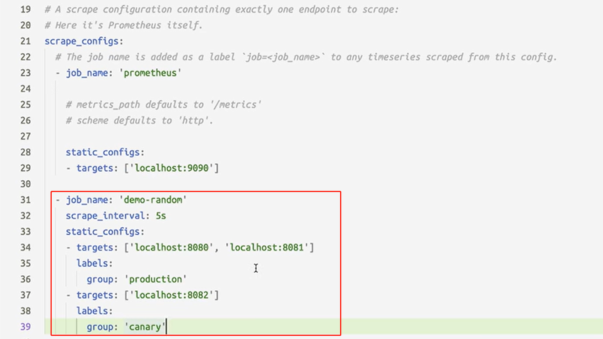
注：格式需完全相同，否则报错无法启动。例如最后的：`group: 'local'`这个中间必须有空格

参数解释：

```
global    # 此片段指定的是prometheus的全局配置， 比如采集间隔，抓取超时时间等。
 
rule_files   # 此片段指定报警规则文件， prometheus根据这些规则信息，会推送报警信息到alertmanager中。
 
scrape_configs    # 此片段指定抓取配置，prometheus的数据采集通过此片段配置。
 
alerting    # 此片段指定报警配置， 这里主要是指定prometheus将报警规则推送到指定的alertmanager实例地址。
 
remote_write    # 指定后端的存储的写入api地址。
 
remote_read    # 指定后端的存储的读取api地址
 
scrape_interval  # 抓取间隔,默认继承global值。
 
scrape_timeout   # 抓取超时时间,默认继承global值。
 
evaluation_interval # 评估规则间隔
 
external_labels  # 外部一些标签设置
 
metric_path     # 抓取路径， 默认是/metrics
 
scheme # 指定采集使用的协议，http或者https。
 
params # 指定url参数。
 
basic_auth # 指定认证信息。
 
*_sd_configs # 指定服务发现配置
 
static_configs # 静态指定服务job。
 
relabel_config # relabel设置。
```

普罗米修斯（prometheus）监控部署
环境: centos7

## 二、服务端安装

参考：
https://www.cnblogs.com/scajy/p/16952109.html
https://zhuanlan.zhihu.com/p/574729059

安装

```
下载
wget https://github.com/prometheus/prometheus/releases/download/v2.41.0/prometheus-2.41.0.linux-amd64.tar.gz
解压
tar -zxvf prometheus-2.41.0.linux-amd64.tar.gz
#放通防火墙
firewall-cmd --zone=public --add-port=9090/tcp --permanent
firewall-cmd --reload
#测试启动prometheus服务
cd prometheus-2.41.0.linux-amd64
./prometheus
```

### 2.1 编写prometheus的systemd服务脚本

```
移动prometheus程序
mv prometheus-2.25.2.linux-amd64 prometheus
mv prometheus /opt/monitor/
编写prometheus的systemd服务脚本
vim /usr/lib/systemd/system/prometheus.service
[Unit]
Description=prometheus
[Service]
ExecStart=/opt/monitor/prometheus/prometheus --config.file=/opt/monitor/prometheus/prometheus.yml --web.enable-lifecycle
ExecReload=/bin/kill -HUP $MAINPID
KillMode=process
Restart=on-failure
[Install]
WantedBy=multi-user.target
启动服务
systemctl daemon-reload
systemctl start prometheus
systemctl enable prometheus
```

### 2.2 热加载prometheus.yml文件更新配置

上面编写的systemd服务脚本中 `--web.enable-lifecycle` 参数开启配置文件热加载，开启后修改 prometheus.yml 配置文件后不用重启 prometheus 服务，支持两种方式重新加载配置文件：

```
# 第一种：向prometheus进行发信号;通过 kill 命令的 HUP (hang up) 参数实现:
kill -HUP pid
# 第二种，向prometheus发送HTTP请求
# /-/reload 只接收POST请求，并且需要在启动prometheus进程时已经添加 --web.enable-lifecycle字段。
# curl -X POST http://IP/-/reload
curl -X POST http://localhost:9090/-/reload
```

### 2.3 动态配置

编辑prometheus.yml参数,基于文件实现动态配置

后期就不用再次重启配置文件了，只需要修改 ./static_conf/file.yaml

promethues 会每隔5s读取文件（refresh_interval: 5s）

```
scrape_configs:
  # The job name is added as a label `job=<job_name>` to any timeseries scraped from this config.
  - job_name: "prometheus"
    # metrics_path defaults to '/metrics'
    # scheme defaults to 'http'.
    static_configs:
      - targets: ["localhost:9090"]
  - job_name: "prometheus_local"
    static_configs:
      - targets: ["localhost:9100"]
        labels:
          group: 'local'
  - job_name: 'node-exporter'
    scrape_interval: 15s
    file_sd_configs:
      - files:
        - "static_conf/*.yaml"
        refresh_interval: 5s
### 以下为关键信息，及注释:
  - job_name: 'node-exporter'
    scrape_interval: 15s
    file_sd_configs:
      - files:
        - "static_conf/*.yaml"  #动态配置要读取的文件
        refresh_interval: 5s  #动态配置的刷新间隔
### 注释结束
```


```
[root@localhost prometheus]# mkdir static_conf
[root@localhost prometheus]# cat static_conf/file.yaml
- targets: ['127.0.0.1:9100']
- targets: ['127.0.0.2:9100']
  labels:
    group: 'local'
- targets: ['127.0.0.3:9100']
#上面示例中，给第二台机器添加了组标签
当前为prometheus程序位置，目录结构：tree ./
├── prometheus
├── prometheus.yml
└── static_conf  #刚建的目录
    └── file.yaml  #动态配置文件
```


## 三、客户端 服务器监控 node_exporte

获取下载链接：https://prometheus.io/download/

```
# node_exporter部署 不建议docker部署
mkdir -p /opt/node_exporter
curl -LO https://github.com/prometheus/node_exporter/releases/download/v1.5.0/node_exporter-1.5.0.linux-amd64.tar.gz
tar -zxvf node_exporter-1.5.0.linux-amd64.tar.gz -C /opt/node_exporter
# 切换到解压后的目录node_exporter-1.5.0.linux-amd64 移动解压后的文件到上级目录 node_exporter
cd /opt/node_exporter/node_exporter-1.5.0.linux-amd64
mv * ../
vim /usr/lib/systemd/system/node_exporter.service
# 设置服务
cat /usr/lib/systemd/system/node_exporter.service
[unit]
Description=The node_exporter Server
Wants=network-online.target
After=network.target
[Service]
ExecStart=/opt/node_exporter/node_exporter
Restart=on-failure
RestartSec=15s
SyslogIdentifier=node_exporter
[Install]
WantedBy=multi-user.target
# 启动服务
systemctl daemon-reload
systemctl start node_exporter
systemctl status node_exporter
systemctl enable node_exporter
#放通防火墙
firewall-cmd --zone=public --add-port=9100/tcp --permanent
firewall-cmd --reload
```

# 四、 docker 部署

相关网址：

- [官网](https://prometheus.io/)
- [GitHub](https://github.com/prometheus/prometheus)
- [DockerHub](https://hub.docker.com/r/prom/prometheus)

### 4.1 Docker部署

[官方部署文档地址](https://prometheus.io/docs/prometheus/latest/installation/)
`Prometheus`配置文件目录在：`/etc/prometheus/prometheus.yml`,这个很重要,需要配置客户端Node节点。

Docker部署

```bash
#新建Data存储目录
mkdir -p  /dockerdata/prometheus/data

#新建一个临时容器拷贝配置文件
docker run -d --name prometheus prom/prometheus
docker cp prometheus:/etc/prometheus/prometheus.yml  /dockerdata/prometheus
docker rm -f prometheus
#新增目录写入权限
chown -R 1000:1000   /dockerdata/prometheus
chmod -R 777  /dockerdata/prometheus
#修改配置文件配置，参考下面模板和简洁版
vi  /dockerdata/prometheus/prometheus.yml


# Run，设置参数
docker run -d -p 9090:9090  --name prometheus  \
-v /dockerdata/prometheus/prometheus.yml:/etc/prometheus/prometheus.yml  \
-v /dockerdata/prometheus/data:/data/PromDB  \
 prom/prometheus \
--config.file="/etc/prometheus/prometheus.yml" \
--web.listen-address="0.0.0.0:9090"  \
--web.max-connections=512  \
--web.enable-lifecycle    \
--storage.tsdb.path="/data/PromDB"   \
--storage.tsdb.retention.time=30d   \
--storage.tsdb.retention.size=2TB   \
--query.timeout=2m   \
--query.max-concurrency=20  \
--storage.tsdb.no-lockfile   \
--storage.tsdb.wal-compression   
```

| 参数                         | 含义                                                         |
| ---------------------------- | ------------------------------------------------------------ |
| config.file                  | 指定配置文件                                                 |
| web.listen-address           | 指定监听地址                                                 |
| web.max-connections          | Web最大并发连接数                                            |
| web.enable-lifecycle         | 动态加载配置功能                                             |
| storage.tsdb.path            | 指定数存储目录                                               |
| storage.tsdb.retention.time  | 数据保存时长，过期清理， 默认 15 天                          |
| storage.tsdb.retention.size  | 存储目录大小。B, KB, MB, GB, TB, PB, EB #指定 chunk 大小， 默认 512MB |
| query.timeout                | 最大查询超时时间                                             |
| query.max-concurrency        | 最大查询并发数                                               |
| storage.tsdb.no-lockfile     | 不在数据目录中创建锁文件                                     |
| storage.tsdb.wal-compression | 压缩tsdb WAL                                                 |


### 4.2 服务参数

Prometheus服务参数相关配置,进入容器后可以使用`prometheus -h`命令查看

```haskell
Flags:
#帮助
  -h, --help                     Show context-sensitive help (also try --help-long and --help-man).
#版本
      --version                  Show application version.
#配置文件
      --config.file="prometheus.yml"  
                                 Prometheus configuration file path.
#监听端口
      --web.listen-address="0.0.0.0:9090"  
                                 Address to listen on for UI, API, and telemetry.
#空闲连接的超时时间
      --web.read-timeout=5m      Maximum duration before timing out read of the request, and closing idle connections.
#最大连接数
      --web.max-connections=512  Maximum number of simultaneous connections.

#可从外部访问Prometheus的URL（例如，如果Prometheus是通过反向代理提供的）。 用于生成返回到Prometheus本身的相对和绝对链接。 如果URL包含路径部分，它将被用作Prometheus服务的所有HTTP端点的前缀。 如果省略，则会自动派生相关的URL组件。
      --web.external-url=<URL>   The URL under which Prometheus is externally reachable (for example, if Prometheus is served via a reverse proxy). Used for generating relative and absolute links back to
                                 Prometheus itself. If the URL has a path portion, it will be used to prefix all HTTP endpoints served by Prometheus. If omitted, relevant URL components will be derived
                                 automatically.
#内部路由的前缀。 默认为--web.external-url的路径。
      --web.route-prefix=<path>  Prefix for the internal routes of web endpoints. Defaults to path of --web.external-url.
#静态资源目录的路径，位于/ user
      --web.user-assets=<path>   Path to static asset directory, available at /user.
#启用是否通过HTTP请求重新加载
      --web.enable-lifecycle     Enable shutdown and reload via HTTP request.
#管理控制操作启用API端点
      --web.enable-admin-api     Enable API endpoints for admin control actions.
#模板目录的路径，位于/consoles
      --web.console.templates="consoles"  
                                 Path to the console template directory, available at /consoles.
#控制台库目录的路径
      --web.console.libraries="console_libraries"  
                                 Path to the console library directory.
#Prometheus实例页面的文档标题
      --web.page-title="Prometheus Time Series Collection and Processing Server"  
                                 Document title of Prometheus instance.
#用于CORS来源的正则表达式。 
      --web.cors.origin=".*"     Regex for CORS origin. It is fully anchored. Example: 'https?://(domain1|domain2)\.com'
#指标(数据）存储的基本路径
      --storage.tsdb.path="data/"  
                                 Base path for metrics storage.
#将数据保留多长时间。 此标志已被弃用，请改用“ storage.tsdb.retention.time”。
      --storage.tsdb.retention=STORAGE.TSDB.RETENTION  
                                 [DEPRECATED] How long to retain samples in storage. This flag has been deprecated, use "storage.tsdb.retention.time" instead.
#将数据保留多长时间。默认15天
      --storage.tsdb.retention.time=STORAGE.TSDB.RETENTION.TIME  
                                 How long to retain samples in storage. When this flag is set it overrides "storage.tsdb.retention". If neither this flag nor "storage.tsdb.retention" nor
                                 "storage.tsdb.retention.size" is set, the retention time defaults to 15d.
#可以为块存储的最大字节数。 支持的单位：KB，MB，GB，TB，PB。
      --storage.tsdb.retention.size=STORAGE.TSDB.RETENTION.SIZE  
                                 [EXPERIMENTAL] Maximum number of bytes that can be stored for blocks. Units supported: KB, MB, GB, TB, PB. This flag is experimental and can be changed in future releases.
#不在数据目录中创建锁文件
      --storage.tsdb.no-lockfile  
                                 Do not create lockfile in data directory.
#允许重叠的块，从而启用垂直压缩和垂直查询合并。
      --storage.tsdb.allow-overlapping-blocks  
                                 [EXPERIMENTAL] Allow overlapping blocks, which in turn enables vertical compaction and vertical query merge.
#压缩tsdb WAL
      --storage.tsdb.wal-compression  
                                 Compress the tsdb WAL.
#关闭或配置重新加载时等待刷写数据的时间
      --storage.remote.flush-deadline=<duration>  
                                 How long to wait flushing sample on shutdown or config reload.
#在单个查询中通过远程读取接口返回的最大样本总数。 0表示没有限制。 对于流式响应类型，将忽略此限制。
      --storage.remote.read-sample-limit=5e7  
                                 Maximum overall number of samples to return via the remote read interface, in a single query. 0 means no limit. This limit is ignored for streamed response types.
#并发远程读取调用的最大数目。 0表示没有限制。
      --storage.remote.read-concurrent-limit=10  
                                 Maximum number of concurrent remote read calls. 0 means no limit.
#用于流式传输远程读取响应类型的单个帧中的最大字节数。 请注意，客户端也可能会限制帧大小。 1MB为默认情况下由protobuf推荐
--storage.remote.read-max-bytes-in-frame=1048576  
                                 Maximum number of bytes in a single frame for streaming remote read response types before marshalling. Note that client might have limit on frame size as well. 1MB as
                                 recommended by protobuf by default.
#容忍中断以恢复警报“ for”状态的最长时间。
      --rules.alert.for-outage-tolerance=1h  
                                 Max time to tolerate prometheus outage for restoring "for" state of alert.
#警报和恢复的“ for”状态之间的最短持续时间。 仅对于配置的“ for”时间大于宽限期的警报，才保持此状态。
      --rules.alert.for-grace-period=10m  
                                 Minimum duration between alert and restored "for" state. This is maintained only for alerts with configured "for" time greater than grace period.
#将警报重新发送到Alertmanager之前等待的最短时间。
      --rules.alert.resend-delay=1m  
                                 Minimum amount of time to wait before resending an alert to Alertmanager.
#等待的Alertmanager通知的队列容量。
      --alertmanager.notification-queue-capacity=10000  
                                 The capacity of the queue for pending Alertmanager notifications.
#向Alertmanager发送警报的超时。
      --alertmanager.timeout=10s  
                                 Timeout for sending alerts to Alertmanager.
#在表达式求值期间检索指标的最大回溯持续时间。
      --query.lookback-delta=5m  The maximum lookback duration for retrieving metrics during expression evaluations.
#最大查询时间。
      --query.timeout=2m         Maximum time a query may take before being aborted.
#最大查询并发数
      --query.max-concurrency=20  
                                 Maximum number of queries executed concurrently.
#单个查询可以加载到内存中的最大样本数。 请注意，如果查询尝试将更多的样本加载到内存中，则查询将失败，因此这也限制了查询可以返回的样本数。
      --query.max-samples=50000000  
                                 Maximum number of samples a single query can load into memory. Note that queries will fail if they try to load more samples than this into memory, so this also limits the
                                 number of samples a query can return.
#日志级别
      --log.level=info           Only log messages with the given severity or above. One of: [debug, info, warn, error]
#日志格式
      --log.format=logfmt        Output format of log messages. One of: [logfmt, json]
```


### 4.3 Prometheus.yml配置

默认`prometheus.yml`配置

```yaml
global:
  scrape_interval: 15s # Set the scrape interval to every 15 seconds. Default is every 1 minute.
  evaluation_interval: 15s # Evaluate rules every 15 seconds. The default is every 1 minute.
  # scrape_timeout is set to the global default (10s).

# Alertmanager configuration
alerting:
  alertmanagers:
    - static_configs:
        - targets:
          # - alertmanager:9093

# Load rules once and periodically evaluate them according to the global 'evaluation_interval'.
rule_files:
  # - "first_rules.yml"
  # - "second_rules.yml"

# A scrape configuration containing exactly one endpoint to scrape:
# Here it's Prometheus itself.
scrape_configs:
  # The job name is added as a label `job=<job_name>` to any timeseries scraped from this config.
  - job_name: "prometheus"

    # metrics_path defaults to '/metrics'
    # scheme defaults to 'http'.

    static_configs:
      - targets: ["localhost:9090"]
```

修改后的简化版`prometheus.yml`

```yaml
global:
  scrape_interval:   60s
  evaluation_interval: 60s
 
scrape_configs:
  - job_name: "prometheus"
    static_configs:
      - targets: ['localhost:9090']
        labels:
          instance: prometheus
```

浏览器访问`http://172.25.255.30:9090`，看看是否启动成功

浏览器访问`http://172.25.255.30:9090/targets`可以查看所有节点


[回到顶部](https://www.cnblogs.com/RainFate/p/16888883.html?share_token=6AAA68F8-063F-428C-AF7A-104B6A2572B4&tt_from=weixin&utm_source=weixin&utm_medium=toutiao_ios&utm_campaign=client_share&wxshare_count=1#_labelTop)

# 五、 Exporter 加入prometheus


### 5.1 简介

Exporter是一类数据采集组件的总称。Exporter负责从目标处搜集数据，并将其转化为Prometheus支持的格式，它开放了一个http接口(以便Prometheus抓取数据)。与传统的数据采集组件不同的是Exporter并不向中央服务器发送数据，而是等待中央服务器(如Prometheus等)主动前来抓取数据。

Exporter有很多客户端部署方式，下载地址：`https://prometheus.io/download/`
相关网址：

- [官网](https://prometheus.io/)
- [GitHub-Node](https://github.com/prometheus/node_exporter)
- [GitHub-客户端](https://github.com/prometheus-community)
- [DockerHub](https://hub.docker.com/r/prom/node-exporter)
- [官方部署文档地址](https://prometheus.io/docs/instrumenting/exporters/)


### 5.2 客户端安装地址

- [Windows](https://github.com/prometheus-community/windows_exporter/releases)
- [Linux](https://github.com/prometheus/node_exporter/releases/)
- [Docker](https://hub.docker.com/r/prom/node-exporter)
- [Mysql](https://github.com/prometheus/mysqld_exporter/releases)
- [Elasticsearch](https://github.com/prometheus-community/elasticsearch_exporter)
- [Consul](https://github.com/prometheus/consul_exporter/releases)


### 5.3 部署

 [官方部署文档地址](https://prometheus.io/docs/instrumenting/exporters/)

Docker部署

```bash
docker pull prom/node-exporter
docker run -d -p 9100:9100 -v "/proc:/host/proc:ro" -v "/sys:/host/sys:ro" -v "/:/rootfs:ro" --name node-exporter prom/node-exporter   --path.rootfs=/host
```

访问`http://172.25.255.30:9100`，看看是否部署成功


### 5.4 Prometheus加入Exporter节点配置

编辑`Prometheus`配置文件添加`node`子节点，`vi /dockerdata/prometheus/prometheus.yml`

```yaml
global:
  scrape_interval:   60s
  evaluation_interval: 60s

scrape_configs:
  - job_name: "prometheus"
    static_configs:
      - targets: ['localhost:9090']
        labels:
          instance: prometheus

  - job_name: linuxnode1
    static_configs:
      - targets: ['172.25.255.30:9100']
        labels:
          instance: linuxnode1
```

重启容器

```undefined
docker  restart   prometheus 
docker  restart   node-exporter
```

等2分钟后访问`http://172.25.255.30:9090/targets`，查看添加的节点是否Up


添加多个节点

```yaml
global:
  scrape_interval:   60s
  evaluation_interval: 60s

scrape_configs:
  - job_name: "prometheus"
    static_configs:
      - targets: ['localhost:9090']
        labels:
          instance: prometheus

  - job_name: linuxnode1
    static_configs:
      - targets:
        - 172.25.255.30:9100
        - 172.25.240.1:9182
        labels:
          instance: linuxnode1

  - job_name: linuxnode2
    static_configs:
      - targets:
        - 172.25.255.30:9100
        - 172.25.240.1:9182
        labels:
          instance: linuxnode2
```

访问`http://172.25.255.30:9090/targets`


[回到顶部](https://www.cnblogs.com/RainFate/p/16888883.html?share_token=6AAA68F8-063F-428C-AF7A-104B6A2572B4&tt_from=weixin&utm_source=weixin&utm_medium=toutiao_ios&utm_campaign=client_share&wxshare_count=1#_labelTop)

# 六、prometheus_snmp

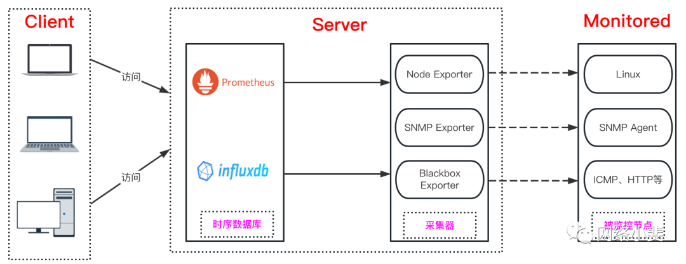


## 6.1 linux 安装

### 6.1.1 在 Linux 系统部署snmp_exporter二进制文件

```
#解压文件
[root@localhost monitor]# pwd
/opt/monitor
[root@localhost monitor]# tar -zxvf snmp_exporter-0.20.0.linux-amd64.tar.gz
[root@localhost monitor]# mv snmp_exporter-0.20.0.linux-amd64 snmp_exporter
[root@localhost monitor]# ls
prometheus  snmp_exporter
```

### 6.1.2 编写snmp_exporter的systemd服务脚本

使用系统的 Systemd 来控制服务启停，系统服务文件可以这么写， 该脚本源自官方提供的脚本，相比于官方脚本增加了SNMP Exporter 运行端口的指定。文件 snmp_exporter.service 的内容如下：

```
vim /usr/lib/systemd/system/snmp_exporter.service
[Unit]
Description=snmp_exporter
After=network.target
[Service]
ExecStart=/opt/monitor/snmp_exporter/snmp_exporter --config.file=/opt/monitor/snmp_exporter/snmp.yml
Restart=on-failure
[Install]
WantedBy=multi-user.target
```

snmp_exporter运行可以加入哪些参数，可以执行snmp_exporte –help查看。

```
#启动服务
systemctl daemon-reload
systemctl start snmp_exporter
systemctl enable snmp_exporter
#放通防火墙
firewall-cmd --zone=public --add-port=9116/tcp --permanent
firewall-cmd --reload
```

启动好以后，我们可以访问 [http://localhost:9116](http://localhost:9116/) 来查看启动的 SNMP Exporter ，页面上会显示 Target、Module、Submit、Config 这几个选项和按钮。
在 Target 中填写交换机的地址，Module 里选择对应的模块，然后点击 Submit 这样可以查到对应的监控指标，来验证采集是否成功。
点击 Config 会显示当前 snmp.yml 的配置内容。
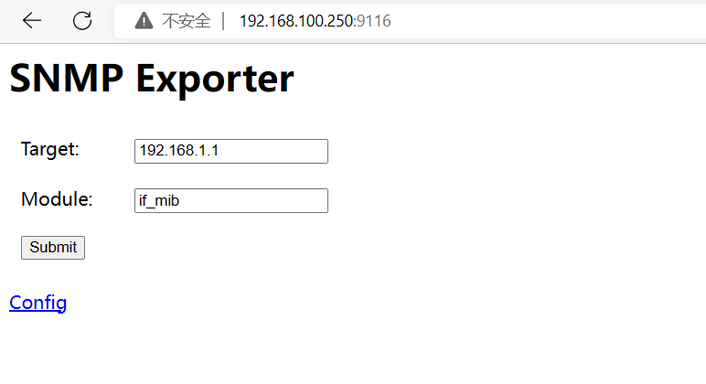

示例：交换机已开启snmp，默认团体名 public
Target 中填写 192.168.1.1，点击 Submit

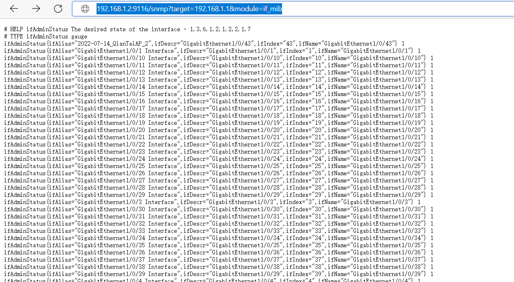

**在Linux命令行中可以curl来验证：**
snmp_exporter服务器的ip: 192.168.1.2
开启SNMP的交换机ip： 192.168.1.1
curl “http://192.168.1.2:9116/snmp?module=if_mib&target=192.168.1.1"

对于 SNMP Exporter 的使用来说， 配置文件比较重要，配置文件中根据硬件的 MIB 文件生成了 OID 的映射关系。以 Cisco 交换机为例，在官方 GitHub 上下载最新的 snmp.yml 文件，由于 Cisco 交换机使用的是 if_mib 模块，在 if_mib 下新增 auth ，用来在请求交换机的时候做验证使用，这个值是提前配置在交换机上的。

snmp.yml 文件中关于采集的监控项是在 walk 字段下，如果要新增监控项，写在 walk 项下。我新增了交换机的 CPU 和内存信息。

```
.....
if_mib:
  auth:
    community: xxxx
  walk:
  - 1.3.6.1.2.1.2
  - 1.3.6.1.2.1.31.1.1
  - 1.3.6.1.4.1.9.2.1  # 交换机 CPU 相关信息
  - 1.3.6.1.4.1.9.9.48  # 交换机内存相关信息
  get:
  - 1.3.6.1.2.1.1.3.0
  metrics:
  - name: busyPer
    oid: 1.3.6.1.4.1.9.2.1.56.0
    type: gauge
    help: CPU utilization
  - name: avgBusy1
    oid: 1.3.6.1.4.1.9.2.1.57.0
    type: gauge
    help: CPU utilization in the past 1 minute
  - name: avgBusy2
    oid: 1.3.6.1.4.1.9.2.1.58.0
    type: gauge
    help: CPU utilization in the past 5 minute
  - name: MemoryPoolFree
    oid: 1.3.6.1.4.1.9.9.48.1.1.1.6.1
    type: gauge
    help: ciscoMemoryPoolFree
  - name: MemoryPoolUsed
    oid: 1.3.6.1.4.1.9.9.48.1.1.1.5.1
    type: gauge
    help: ciscoMemoryPoolUsed
```

如果上边验证没有问题，那么我们就可以配置 Prometheus 进行采集了。

```
 - job_name: "SNMP"
    scrape_interval: 1m  # 默认抓取周期，可用单位m s、smhdwy #全局默认1分钟
    scrape_timeout: 30s  # 默认抓取超时，全局默认10s
    static_configs:
      - targets:
          - 192.168.1.1  # 思科交换机的 IP 地址
    metrics_path: /snmp
    params:
      module:
        - if_mib  # 如果是其他设备，请更换其他模块。
      community:
        - public  #  指定 community团体名为public，当 snmp_exporter snmp.yml 配置文件没有指定 community，此处定义的 community 生效。
    relabel_configs:
      - source_labels: [__address__]
        target_label: __param_target
      - source_labels: [__param_target]
        target_label: instance
      - target_label: __address__
        replacement: "localhost:9116"  # SNMP Exporter  的地址和端口
```

如果snmp抓取数据报错，提示`GET "http://192.168.1.2:9116/snmp?module=if_mib&target=192.168.1.1"：context deadline exceeded` ，
那么可能是Scrape Duration超时，修改延长 scrape_timeout: 30s 参数即可。

配置好 Prometheus 以后启动 Prometheus 服务 ，就可以查到 Cisco 交换机的监控信息了。
接下来就 Prometheus 配置告警规则，Grafana 进行画图了。这些操作和其他组件并无区别，就不再赘述。


## 6.2  源码编译安装snmp_exporter

地址

```
https://github.com/prometheus/snmp_exporter.git
```

配置生成器编译生成

```
服务文件
# Go编译生成snmp_exporter二进制执行文件
go build
```


## 6.3  **生成snmp配置的工具**

**1、go build**

```
snmp_exporter/generator/
go build
ls -al | grep generator
make mibs
```


**2、make mibs**

`make mibs`是下载所有的交换机的oid文件

```
$ make mibs      
>> Downloading apc-powernet-mib
# Workaround to make DisplayString available (#867)
>> Downloading Cisco AIRESPACE-REF-MIB
>> Downloading Cisco AIRESPACE-WIRELESS-MIB
>> Downloading ARISTA-ENTITY-SENSOR-MIB
>> Downloading ARISTA-SMI-MIB
>> Downloading ARISTA-SW-IP-FORWARDING-MIB
>> Downloading Cisco ENTITY-MIB
>> Downloading Cisco ENTITY-SENSOR-MIB
>> Downloading Cisco ENTITY-STATE-MIB
>> Downloading Cisco ENTITY-STATE-TC-MIB
>> Downloading IANA charset MIB
>> Downloading IANA ifType MIB
>> Downloading IANA printer MIB
>> Downloading Cisco ISDN-MIB
>> Downloading KEEPALIVED-MIB
>> Downloading VRRP-MIB
>> Downloading VRRPv3-MIB
>> Downloading Kemp LM MIBs to /var/folders/51/9228hm_53950hw71yngx8lx40000gp/T/tmp.ZBhmkAmI
Archive:  /var/folders/51/9228hm_53950hw71yngx8lx40000gp/T/tmp.ZBhmkAmI
  inflating: mibs/7.2.50.0.18765.RELEASE-ONE4NET-MIB.txt  
  inflating: mibs/7.2.50.0.18765.RELEASE-B100-MIB.txt  
```


说明：因官方提供的默认snmp.yml配置文件，只包含国外比较常规的设备型号的OID信息，比如思科设备，并不符合国内的需求，故大部分定制化需求都需要自定义生成器配置文件，利用配置生成器生成snmp.yml文件，获取自定义监控数据的需要。

**generator目录就是配置生成器的源码目录，故在源码目录路径下执行****go bulid****编译生成generator二进制可执行文件，并生成mibs文件夹，主要是存放各类mib库文件所在的目录，****make mibs****会默认下载官方默认提供的一批常规mib库，如下图所示：**

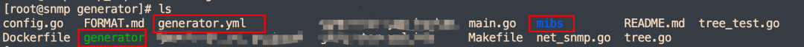


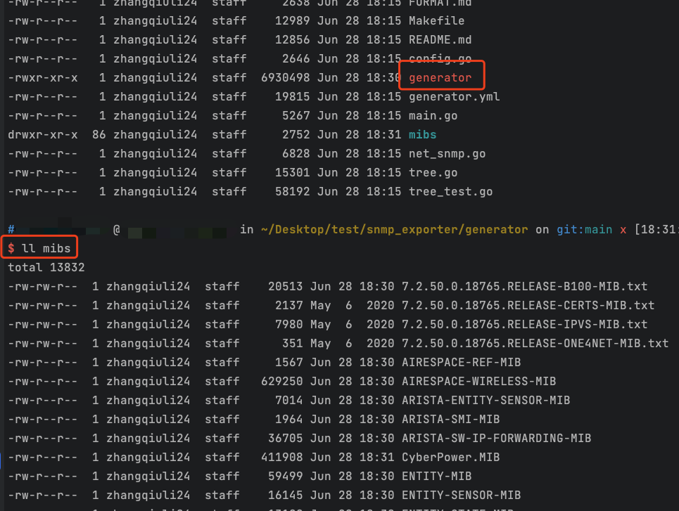

该目录中主要关注2个文件和1个目录，就图上红框标注目录，generator是配置生成器二进制执行文件，generator.yml是OID采集配置文件，mibs目录是存放mib库默认路径。

至此完成基本的部署，接下来就是需要做配置生成器的配置文件编写，以及对应华为无线控制器的对应版本mib库文件下载并上传上图中mibs文件夹中，参考华为官方提供mib参考信息，根据需要监控的信息去获取数据，并纳入到Prometheus中。

**3、生成snmp.yaml**

```
cat generator.yml
modules:
  # Default IF-MIB interfaces table with ifIndex.
  if_mib:
    walk: [sysUpTime, interfaces, ifXTable]
    lookups:
      - source_indexes: [ifIndex]
        lookup: ifAlias
      - source_indexes: [ifIndex]
        # Uis OID to avoid conflict with PaloAlto PAN-COMMON-MIB.
        lookup: 1.3.6.1.2.1.2.2.1.2 # ifDescr
      - source_indexes: [ifIndex]
        # Use OID to avoid conflict with Netscaler NS-ROOT-MIB.
        lookup: 1.3.6.1.2.1.31.1.1.1.1 # ifName
    overrides:
      ifAlias:
        ignore: true # Lookup metric
      ifDescr:
        ignore: true # Lookup metric
      ifName:
        ignore: true # Lookup metric
      ifType:
        type: EnumAsInfo
```


**4、设置mibs的环境变量**

```
export MIBDIRS=mibs
```

**5、生成配置**

```
./generator generate
生成的配置文件在当前目录下snmp.yml
```


### 6.3.1 generator.yml文件格式说明

参考 https://github.com/prometheus/snmp_exporter/tree/58b902ede4f6bee7a150566ac7fae05ef0a4b1fb/generator

```
modules:
  module_name:  # #模块名称。您可以拥有任意数量的模块。
    walk:       # #要行走的OID列表。也可以是SNMP对象名称或特定实例。
      - 1.3.6.1.2.1.2              # Same as "interfaces"
      - sysUpTime                  # Same as "1.3.6.1.2.1.1.3"
      - 1.3.6.1.2.1.31.1.1.1.6.40  # Instance of "ifHCInOctets" with index "40" #索引为“40”的“ifHCInOctets”实例
    version: 2  # SNMP version to use. Defaults to 2. #版本：要使用的2#SNMP版本。默认值为2。
                # 1 will use GETNEXT, 2 and 3 use GETBULK. #1将使用GETNEXT，2和3将使用GETBULK。
    max_repetitions: 25  # #使用GET/GETBULK请求多少个对象，默认为25。
                         # #对于有问题的设备，可能需要减少。
    retries: 3   # #重试失败请求的次数，默认为3。
    timeout: 5s  # #每个SNMP请求的超时，默认为5s。
    auth:
      # #团体字符串用于SNMP v1和v2。默认为“public”。
      community: public
      # #v3具有不同且更复杂的设置。
      # #需要哪些取决于安全级别。
      # The equivalent options on NetSNMP commands like snmpbulkwalk
      # and snmpget are also listed. See snmpcmd(1).
      username: user  # Required, no default. -u option to NetSNMP.
      security_level: noAuthNoPriv  # Defaults to noAuthNoPriv. -l option to NetSNMP.
                                    # Can be noAuthNoPriv, authNoPriv or authPriv.
      password: pass  # Has no default. Also known as authKey, -A option to NetSNMP.
                      # Required if security_level is authNoPriv or authPriv.
      auth_protocol: MD5  # MD5, SHA, SHA224, SHA256, SHA384, or SHA512. Defaults to MD5. -a option to NetSNMP.
                          # Used if security_level is authNoPriv or authPriv.
      priv_protocol: DES  # DES, AES, AES192, or AES256. Defaults to DES. -x option to NetSNMP.
                          # Used if security_level is authPriv.
      priv_password: otherPass # Has no default. Also known as privKey, -X option to NetSNMP.
                               # Required if security_level is authPriv.
      context_name: context # Has no default. -n option to NetSNMP.
                            # Required if context is configured on the device.
    lookups:  # Optional list of lookups to perform.查找：#要执行的查找的可选列表。
              # #“keep_source_indexes”的默认值为false。要使用此选项，索引必须是唯一的。
      # #如果一个表的索引是bsnDot11EssIndex，通常这是该表的结果度量的标签。相反，使用索引来查找bsndot1EssSsid表条目并创建bsnDot11EssSsid标签
      - source_indexes: [bsnDot11EssIndex]
        lookup: bsnDot11EssSsid
        drop_source_indexes: false  # If true, delete source index labels for this lookup.
                                    # This avoids label clutter when the new index is unique.
      # #还可以链接查找或使用多个标签来收集标签值。这可能有助于将多个索引标签解析为适当的人类可读标签。请注意这里的订货很重要。
      # 在本例中，我们首先进行查找以获取“cbQosConfigIndex”作为另一个标签。
      - source_indexes: [cbQosPolicyIndex, cbQosObjectsIndex]
        lookup: cbQosConfigIndex
      # Using the newly added label, we have another lookup to fetch the `cbQosCMName` based on `cbQosConfigIndex`.
      - source_indexes: [cbQosConfigIndex]
        lookup: cbQosCMName
     overrides: # Allows for per-module overrides of bits of MIBs
       metricName:
         ignore: true # Drops the metric from the output.
         regex_extracts:
           Temp: # A new metric will be created appending this to the metricName to become metricNameTemp.
             - regex: '(.*)' # Regex to extract a value from the returned SNMP walks's value.
               value: '$1' # The result will be parsed as a float64, defaults to $1.
           Status:
             - regex: '.*Example'
               value: '1' # The first entry whose regex matches and whose value parses wins.
             - regex: '.*'
               value: '0'
         type: DisplayString # 覆盖度量类型，可能的类型有:
                             #   gauge:   带类型规的整数.
                             #   counter: 带类型计数器的整数.
                             #   OctetString: A bit string, rendered as 0xff34.
                             #   DateAndTime: An RFC 2579 DateAndTime byte sequence. If the device has no time zone data, UTC is used.
                             #   DisplayString: An ASCII or UTF-8 string.
                             #   PhysAddress48: A 48 bit MAC address, rendered as 00:01:02:03:04:ff.
                             #   Float: A 32 bit floating-point value with type gauge.
                             #   Double: A 64 bit floating-point value with type gauge.
                             #   InetAddressIPv4: An IPv4 address, rendered as 1.2.3.4.
                             #   InetAddressIPv6: An IPv6 address, rendered as 0102:0304:0506:0708:090A:0B0C:0D0E:0F10.
                             #   InetAddress: An InetAddress per RFC 4001. Must be preceded by an InetAddressType.
                             #   InetAddressMissingSize: An InetAddress that violates section 4.1 of RFC 4001 by
                             #       not having the size in the index. Must be preceded by an InetAddressType.
                             #   EnumAsInfo: An enum for which a single timeseries is created. Good for constant values.
                             #   EnumAsStateSet: An enum with a time series per state. Good for variable low-cardinality enums.
                             #   Bits: An RFC 2578 BITS construct, which produces a StateSet with a time series per bit.
```

### 6.3.2generator.yml文件参考：

这次我贴一份比较完整的snmpv3版本的模版：参考网络上，后续我内部的完整模版贴出来，形成最佳实践。

```
modules:
  H3C: 
    walk:
      - 1.3.6.1.2.1.1.1                     #sysDescr
      - 1.3.6.1.2.1.1.3                     #sysUpTimeInstance
      - 1.3.6.1.2.1.1.5                     #sysName   
      - 1.3.6.1.2.1.2.1                     #ifNumber  
      - 1.3.6.1.2.1.2.2.1.1                 #ifIndex
      - 1.3.6.1.2.1.2.2.1.2                 #IfDescr
      - 1.3.6.1.2.1.2.2.1.3                 #ifType
      - 1.3.6.1.2.1.2.2.1.5                 #ifSpeed
      - 1.3.6.1.2.1.31.1.1.1.15             #ifHighSpeed
      - 1.3.6.1.2.1.31.1.1.1.18             #ifAlias
      - 1.3.6.1.2.1.2.2.1.8                 #ifOperStatus
      - 1.3.6.1.2.1.2.2.1.13                #ifInDiscards
      - 1.3.6.1.2.1.2.2.1.14                #ifInErrors
      - 1.3.6.1.2.1.2.2.1.19                #ifOutDiscards
      - 1.3.6.1.2.1.2.2.1.20                #ifOutErrors
      - 1.3.6.1.2.1.31.1.1.1.1              #ifName
      - 1.3.6.1.2.1.2.2.1.10                #ifInOctets
      - 1.3.6.1.2.1.2.2.1.16                #ifOutOctets
      - 1.3.6.1.2.1.31.1.1.1.6              #ifHCInOctets
      - 1.3.6.1.2.1.31.1.1.1.10             #ifHCOutOctets
      - 1.3.6.1.2.1.47.1.1.1.1.2            #entPhysicalDescr
      - 1.3.6.1.2.1.47.1.1.1.1.5            #entPhysicalClass
      - 1.3.6.1.2.1.47.1.1.1.1.7            #entPhysicalName
      - 1.3.6.1.4.1.25506.2.6.1.1.1.1.6     #hh3cEntityExtCpuUsage
      - 1.3.6.1.4.1.25506.2.6.1.1.1.1.8     #hh3cEntityExtMemUsage
      - 1.3.6.1.4.1.25506.2.6.1.1.1.1.12    #hh3cEntityExtTemperature
      - 1.3.6.1.4.1.25506.2.149.1.1.1.4     #hh3cSessionStatCount FW
      - 1.3.6.1.4.1.25506.8.35.9.1.1.1.2    #hh3cDevMFanStatus
      - 1.3.6.1.4.1.25506.8.35.9.1.2.1.2    #hh3cDevMPowerStatus
    max_repetitions: 3
    retries: 3   
    timeout: 25s
    version: 3
    auth:
      username: 5gmec
      password: 此处填写自己的密码
      auth_protocol: MD5
      priv_protocol: AES
      priv_password: 此处填写自己的密码
      security_level: authPriv
    lookups:
      - source_indexes: [ifIndex]
        lookup: ifAlias
      - source_indexes: [ifIndex]
        lookup: 1.3.6.1.2.1.2.2.1.2 # ifDescr
      - source_indexes: [ifIndex]
        lookup: 1.3.6.1.2.1.31.1.1.1.1 # ifName
      - source_indexes: [hh3cEntityExtPhysicalIndex]
        lookup: 1.3.6.1.2.1.47.1.1.1.1.2  #entPhysicalDescr
      - source_indexes: [hh3cEntityExtPhysicalIndex]
        lookup: 1.3.6.1.2.1.47.1.1.1.1.5  #entPhysicalClass
      - source_indexes: [hh3cEntityExtPhysicalIndex]
        lookup: 1.3.6.1.2.1.47.1.1.1.1.7  #entPhysicalName
    overrides:
      ifAlias:
        ignore: true # Lookup metric
      ifDescr:
        ignore: true # Lookup metric
      ifName:
        ignore: true # Lookup metric
      ifType:
        ignore: true # Lookup metric
      entPhysicalDescr:
        ignore: true # Lookup metric
      entPhysicalName:
        ignore: true # Lookup metric
      entPhysicalClass:
        ignore: true # Lookup metric
  HUAWEI: 
    walk:   
      - 1.3.6.1.2.1.1.1                     #sysDescr
      - 1.3.6.1.2.1.1.3                     #sysUpTimeInstance
      - 1.3.6.1.2.1.1.5                     #sysName
      - 1.3.6.1.2.1.2.1                     #ifNumber
      - 1.3.6.1.2.1.2.2.1.1                 #ifIndex
      - 1.3.6.1.2.1.2.2.1.2                 #IfDescr
      - 1.3.6.1.2.1.2.2.1.3                 #ifType
      - 1.3.6.1.2.1.2.2.1.5                 #ifSpeed
      - 1.3.6.1.2.1.31.1.1.1.15             #ifHighSpeed
      - 1.3.6.1.2.1.31.1.1.1.18             #ifAlias
      - 1.3.6.1.2.1.2.2.1.8                 #ifOperStatus
      - 1.3.6.1.2.1.2.2.1.13                #ifInDiscards
      - 1.3.6.1.2.1.2.2.1.14                #ifInErrors
      - 1.3.6.1.2.1.2.2.1.19                #ifOutDiscards
      - 1.3.6.1.2.1.2.2.1.20                #ifOutErrors
      - 1.3.6.1.2.1.31.1.1.1.1              #ifName
      - 1.3.6.1.2.1.2.2.1.10                #ifInOctets
      - 1.3.6.1.2.1.2.2.1.16                #ifOutOctets
      - 1.3.6.1.2.1.31.1.1.1.6              #ifHCInOctets
      - 1.3.6.1.2.1.31.1.1.1.10             #ifHCOutOctets
      - 1.3.6.1.2.1.47.1.1.1.1.1            #entPhysicalIndex
      - 1.3.6.1.2.1.47.1.1.1.1.7            #entPhysicalName
      - 1.3.6.1.4.1.2011.5.25.31.1.1.1.1.5  #hwEntityCpuUsage 
      - 1.3.6.1.4.1.2011.5.25.31.1.1.1.1.7  #hwEntityMemUsage 
      - 1.3.6.1.4.1.2011.5.25.31.1.1.1.1.11 #hwEntityTemperature
      - 1.3.6.1.4.1.2011.6.122.15.1.2.1.4   #hwSecStatMonTotalSess FW
      - 1.3.6.1.4.1.2011.5.25.31.1.1.10.1.7 #hwEntityFanState
    max_repetitions: 3
    retries: 3
    timeout: 25s
    version: 3
    auth:
      username: 5gmec
      password: 此处填写自己的密码
      auth_protocol: MD5
      priv_protocol: AES
      priv_password: 此处填写自己的密码
      security_level: authPriv
    lookups:
      - source_indexes: [ifIndex]
        lookup: ifAlias
      - source_indexes: [ifIndex]
        lookup: 1.3.6.1.2.1.2.2.1.2 # ifDescr
      - source_indexes: [ifIndex]
        lookup: 1.3.6.1.2.1.31.1.1.1.1 # ifName
      - source_indexes: [entPhysicalIndex]
        lookup: 1.3.6.1.2.1.47.1.1.1.1.7 #entPhysicalName
    overrides:
      ifAlias:
        ignore: true # Lookup metric
      ifDescr:
        ignore: true # Lookup metric
      ifName:
        ignore: true # Lookup metric
      ifType:
        ignore: true # Lookup metric
      entPhysicalIndex:
        ignore: true # Lookup metric
      entPhysicalName:
        ignore: true # Lookup metric
  if_mib:
    walk:
      - 1.3.6.1.2.1.1.1                     #sysDescr
      - 1.3.6.1.2.1.1.3                     #sysUpTimeInstance
      - 1.3.6.1.2.1.1.5                     #sysName
      - 1.3.6.1.2.1.2.1                     #ifNumber
      - 1.3.6.1.2.1.2.2.1.1                 #ifIndex
      - 1.3.6.1.2.1.2.2.1.2                 #IfDescr
      - 1.3.6.1.2.1.2.2.1.3                 #ifType
      - 1.3.6.1.2.1.2.2.1.5                 #ifSpeed
      - 1.3.6.1.2.1.31.1.1.1.15             #ifHighSpeed
      - 1.3.6.1.2.1.31.1.1.1.18             #ifAlias
      - 1.3.6.1.2.1.2.2.1.8                 #ifOperStatus
      - 1.3.6.1.2.1.2.2.1.13                #ifInDiscards
      - 1.3.6.1.2.1.2.2.1.14                #ifInErrors
      - 1.3.6.1.2.1.2.2.1.19                #ifOutDiscards
      - 1.3.6.1.2.1.2.2.1.20                #ifOutErrors
      - 1.3.6.1.2.1.31.1.1.1.1              #ifName
      - 1.3.6.1.2.1.2.2.1.10                #ifInOctets
      - 1.3.6.1.2.1.2.2.1.16                #ifOutOctets
      - 1.3.6.1.2.1.31.1.1.1.6              #ifHCInOctets
      - 1.3.6.1.2.1.31.1.1.1.10             #ifHCOutOctets
    max_repetitions: 3
    retries: 3
    timeout: 25s
    version: 3
    auth:
      username: 5gmec
      password: 此处填写自己的密码
      auth_protocol: MD5
      priv_protocol: AES
      priv_password: 此处填写自己的密码
      security_level: authPriv
    lookups:
      - source_indexes: [ifIndex]
        lookup: 1.3.6.1.2.1.2.2.1.2 # ifDescr
      - source_indexes: [ifIndex]
        lookup: 1.3.6.1.2.1.31.1.1.1.1 # ifName
    overrides:
      ifAlias:
        ignore: true # Lookup metric
      ifDescr:
        ignore: true # Lookup metric
      ifName:
        ignore: true # Lookup metric
      ifType:
        ignore: true # Lookup metric
  HILLSTONE:
    walk:
      - 1.3.6.1.4.1.28557.2.2.1.7 
      - 1.3.6.1.4.1.28557.2.2.1.3  #sysCPU           HILLSTONE
      - 1.3.6.1.4.1.28557.2.2.1.17 #sysMemRatio      HILLSTONE
      - 1.3.6.1.4.1.28557.2.28.1.2.1.1 #hillstoneTemperatureIndex
      - 1.3.6.1.4.1.28557.2.28.1.2.1.2 #hillstoneTemperatureDescr
      - 1.3.6.1.4.1.28557.2.28.1.2.1.3 #hillstoneTemperatureValue
      - 1.3.6.1.4.1.28557.2.30.1.1.1.6 #hillstoneVsysCurSession FW
    max_repetitions: 3
    retries: 3
    timeout: 10s
    version: 3
    auth:
      username: 5gmec1
      password: 此处填写自己的密码
      auth_protocol: MD5
      priv_protocol: AES
      priv_password: 此处填写自己的密码
      security_level: authPriv
    lookups:
      - source_indexes: [hillstoneTemperatureIndex]
        lookup: 1.3.6.1.4.1.28557.2.28.1.2.1.2  #hillstoneTemperatureDescr
      - source_indexes: [hillstoneTemperatureIndex]
        lookup: 1.3.6.1.4.1.28557.2.28.1.2.1.3  #hillstoneTemperatureValue
    overrides:
      hillstoneTemperatureIndex:
        ignore: true 
      hillstoneTemperatureDescr:
        ignore: true 
  HILLSTONE_new:
    walk:
      - 1.3.6.1.2.1.1.1                     #sysDescr
      - 1.3.6.1.2.1.1.3                     #sysUpTimeInstance
      - 1.3.6.1.2.1.1.5                     #sysName
      - 1.3.6.1.2.1.2.1                     #ifNumber
      - 1.3.6.1.2.1.2.2.1.1                 #ifIndex
      - 1.3.6.1.2.1.2.2.1.2                 #IfDescr
      - 1.3.6.1.2.1.2.2.1.3                 #ifType
      - 1.3.6.1.2.1.2.2.1.5                 #ifSpeed
      - 1.3.6.1.2.1.31.1.1.1.15             #ifHighSpeed
      - 1.3.6.1.2.1.31.1.1.1.18             #ifAlias
      - 1.3.6.1.2.1.2.2.1.8                 #ifOperStatus
      - 1.3.6.1.2.1.2.2.1.13                #ifInDiscards
      - 1.3.6.1.2.1.2.2.1.14                #ifInErrors
      - 1.3.6.1.2.1.2.2.1.19                #ifOutDiscards
      - 1.3.6.1.2.1.2.2.1.20                #ifOutErrors
      - 1.3.6.1.2.1.31.1.1.1.1              #ifName
      - 1.3.6.1.2.1.2.2.1.10                #ifInOctets
      - 1.3.6.1.2.1.2.2.1.16                #ifOutOctets
      - 1.3.6.1.2.1.31.1.1.1.6              #ifHCInOctets
      - 1.3.6.1.2.1.31.1.1.1.10             #ifHCOutOctets      
      - 1.3.6.1.4.1.28557.2.2.1.7
      - 1.3.6.1.4.1.28557.2.2.1.3  #sysCPU           HILLSTONE
      - 1.3.6.1.4.1.28557.2.2.1.17 #sysMemRatio      HILLSTONE
      - 1.3.6.1.4.1.28557.2.28.1.2.1.1 #hillstoneTemperatureIndex
      - 1.3.6.1.4.1.28557.2.28.1.2.1.2 #hillstoneTemperatureDescr
      - 1.3.6.1.4.1.28557.2.28.1.2.1.3 #hillstoneTemperatureValue
      - 1.3.6.1.4.1.28557.2.30.1.1.1.6 #hillstoneVsysCurSession FW
    max_repetitions: 3
    retries: 3
    timeout: 25s
    version: 3
    auth:
      username: 5gmec
      password: 此处填写自己的密码
      auth_protocol: MD5
      priv_protocol: AES
      priv_password: 此处填写自己的密码
      security_level: authPriv
    lookups:
      - source_indexes: [ifIndex]
        lookup: 1.3.6.1.2.1.2.2.1.2 # ifDescr
      - source_indexes: [ifIndex]
        lookup: 1.3.6.1.2.1.31.1.1.1.1 # ifName
      - source_indexes: [hillstoneTemperatureIndex]
        lookup: 1.3.6.1.4.1.28557.2.28.1.2.1.2  #hillstoneTemperatureDescr
      - source_indexes: [hillstoneTemperatureIndex]
        lookup: 1.3.6.1.4.1.28557.2.28.1.2.1.3  #hillstoneTemperatureValue
    overrides:
      ifAlias:
        ignore: true # Lookup metric
      ifDescr:
        ignore: true # Lookup metric
      ifName:
        ignore: true # Lookup metric
      ifType:
        ignore: true # Lookup metric
      hillstoneTemperatureIndex:
        ignore: true
      hillstoneTemperatureDescr:
        ignore: true
  SHHUAWEI:
    walk:
      - 1.3.6.1.2.1.1.1                     #sysDescr
      - 1.3.6.1.2.1.1.3                     #sysUpTimeInstance
      - 1.3.6.1.2.1.1.5                     #sysName
      - 1.3.6.1.2.1.2.1                     #ifNumber
      - 1.3.6.1.2.1.2.2.1.1                 #ifIndex
      - 1.3.6.1.2.1.2.2.1.2                 #IfDescr
      - 1.3.6.1.2.1.2.2.1.3                 #ifType
      - 1.3.6.1.2.1.2.2.1.5                 #ifSpeed
      - 1.3.6.1.2.1.31.1.1.1.15             #ifHighSpeed
      - 1.3.6.1.2.1.31.1.1.1.18             #ifAlias
      - 1.3.6.1.2.1.2.2.1.8                 #ifOperStatus
      - 1.3.6.1.2.1.2.2.1.13                #ifInDiscards
      - 1.3.6.1.2.1.2.2.1.14                #ifInErrors
      - 1.3.6.1.2.1.2.2.1.19                #ifOutDiscards
      - 1.3.6.1.2.1.2.2.1.20                #ifOutErrors
      - 1.3.6.1.2.1.31.1.1.1.1              #ifName
      - 1.3.6.1.2.1.31.1.1.1.6              #ifHCInOctets
      - 1.3.6.1.2.1.31.1.1.1.10             #ifHCOutOctets
      - 1.3.6.1.2.1.2.2.1.10                #ifInOctets
      - 1.3.6.1.2.1.2.2.1.16                #ifOutOctets
      - 1.3.6.1.2.1.47.1.1.1.1.1            #entPhysicalIndex
      - 1.3.6.1.2.1.47.1.1.1.1.7            #entPhysicalName
      - 1.3.6.1.4.1.2011.5.25.31.1.1.1.1.5  #hwEntityCpuUsage huawei
      - 1.3.6.1.4.1.2011.5.25.31.1.1.1.1.7  #hwEntityMemUsage huawei
      - 1.3.6.1.4.1.2011.5.25.31.1.1.1.1.11 #hwEntityTemperature
      - 1.3.6.1.4.1.2011.6.122.15.1.2.1.4   #hwSecStatMonTotalSess FW
      - 1.3.6.1.4.1.2011.5.25.31.1.1.10.1.7 #hwEntityFanState
    max_repetitions: 3
    retries: 3
    timeout: 25s
    version: 2
    auth:
      community: 此处填写自己的community
    lookups:
      - source_indexes: [ifIndex]
        lookup: ifAlias
      - source_indexes: [ifIndex]
        lookup: 1.3.6.1.2.1.2.2.1.2 # ifDescr
      - source_indexes: [ifIndex]
        lookup: 1.3.6.1.2.1.31.1.1.1.1 # ifName
      - source_indexes: [entPhysicalIndex]
        lookup: 1.3.6.1.2.1.47.1.1.1.1.7 #entPhysicalName
    overrides:
      ifAlias:
        ignore: true # Lookup metric
      ifDescr:
        ignore: true # Lookup metric
      ifName:
        ignore: true # Lookup metric
      ifType:
        ignore: true # Lookup metric
      entPhysicalIndex:
        ignore: true # Lookup metric
      entPhysicalName:
        ignore: true # Lookup metric
  dp: 
    walk:
      - 1.3.6.1.2.1.1.1                     #sysDescr
      - 1.3.6.1.2.1.1.3                     #sysUpTimeInstance
      - 1.3.6.1.2.1.1.5                     #sysName   
      - 1.3.6.1.2.1.2.1                     #ifNumber  
      - 1.3.6.1.2.1.2.2.1.1                 #ifIndex
      - 1.3.6.1.2.1.2.2.1.2                 #IfDescr
      - 1.3.6.1.2.1.2.2.1.3                 #ifType
      - 1.3.6.1.2.1.2.2.1.5                 #ifSpeed
      - 1.3.6.1.2.1.31.1.1.1.15             #ifHighSpeed
      - 1.3.6.1.2.1.31.1.1.1.18             #ifAlias
      - 1.3.6.1.2.1.2.2.1.8                 #ifOperStatus
      - 1.3.6.1.2.1.2.2.1.13                #ifInDiscards
      - 1.3.6.1.2.1.2.2.1.14                #ifInErrors
      - 1.3.6.1.2.1.2.2.1.19                #ifOutDiscards
      - 1.3.6.1.2.1.2.2.1.20                #ifOutErrors
      - 1.3.6.1.2.1.31.1.1.1.1              #ifName
      - 1.3.6.1.2.1.2.2.1.10                #ifInOctets
      - 1.3.6.1.2.1.2.2.1.16                #ifOutOctets
      - 1.3.6.1.2.1.31.1.1.1.6              #ifHCInOctets
      - 1.3.6.1.2.1.31.1.1.1.10             #ifHCOutOctets
      - 1.3.6.1.4.1.31648.3.15.3            #dpCpuRatio
      - 1.3.6.1.4.1.31648.3.15.5            #dpMemRatio
      - 1.3.6.1.4.1.31648.3.15.4            #dpCpuTemperature
      - 1.3.6.1.4.1.31648.3.15.9            #dpSession
      - 1.3.6.1.4.1.31648.3.15.11.1.3       #dpPowerStatus
      - 1.3.6.1.4.1.31648.3.15.12.1.3       #dpFanStatus
    max_repetitions: 3
    retries: 3   
    timeout: 25s
    version: 3
    auth:
      username: 5gmec
      password: 此处填写自己的密码
      auth_protocol: MD5
      priv_protocol: AES
      priv_password: 此处填写自己的密码
      security_level: authPriv
    lookups:
      - source_indexes: [ifIndex]
        lookup: ifAlias
      - source_indexes: [ifIndex]
        lookup: 1.3.6.1.2.1.2.2.1.2 # ifDescr
      - source_indexes: [ifIndex]
        lookup: 1.3.6.1.2.1.31.1.1.1.1 # ifName
      - source_indexes: [dpPowerStatusIndex]
        lookup: 1.3.6.1.4.1.31648.3.15.11.1.1  #dpPowerStatusVsmId
      - source_indexes: [dpFanrStatusIndex]
        lookup: 1.3.6.1.4.1.31648.3.15.12.1.1  #entPhysicalClass
    overrides:
      ifAlias:
        ignore: true # Lookup metric
      ifDescr:
        ignore: true # Lookup metric
      ifName:
        ignore: true # Lookup metric
      ifType:
        ignore: true # Lookup metric
      entPhysicalDescr:
        ignore: true # Lookup metric
      entPhysicalName:
        ignore: true # Lookup metric
      entPhysicalClass:
        ignore: true # Lookup metric
```

### 6.3.3 手工修改snmp.yml添加监控项

有时snmp.yml文件中没有需要的监控项，手工在walk、get、metrics下，增加如下oid和name

```
cat ./snmp_exporter/snmp.yml
#警告：此文件是使用snmp_exporter生成器自动生成的，手动更改将丢失。
H3C:
  walk:
  - 1.3.6.1.2.1.1.3
  - 1.3.6.1.2.1.1.5
  get:
  - 1.3.6.1.2.1.1.3
  - 1.3.6.1.2.1.1.5
  metrics:
  - name: sysUpTime2
    oid: 1.3.6.1.2.1.1.3
    type: gauge
  - name : sysName
    oid: 1.3.6.1.2.1.1.5
    type: DisplayString
  - name: gauge
```

重启 snmp_exporter 使snmp.yml生效
systemctl restart snmp_exporter

Grafana仪表盘

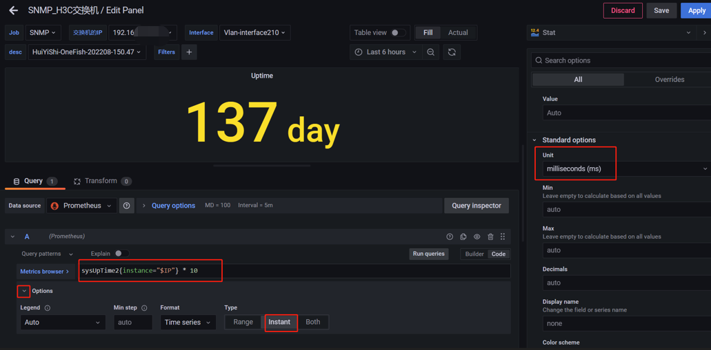

### 6.3.4 多机器不同模块采集，基于文件服务发现

一般情况下，交换机都是有多台，甚至几百上千台，在如此多的设备需要监控采集数据，需要指定不同模块和不同配置文件进行加载采集的，下面简单介绍下多机器部署采集。

编辑prometheus.yml文件，增加如下内容：

```
- job_name: "SNMP"
    scrape_interval: 1m # 覆盖全局默认值
    scrape_timeout: 30s # 覆盖全局默认值
    file_sd_configs: # 基于文件服务发现
      - files:
        - "snmp_device.yml" # 指定 snmp 服务发现配置文件路径
        refresh_interval: 5s # 每隔5秒检查一次
    metrics_path: /snmp
    params:
      module:
        - H3C  # 指定默认采集 MIB 模块的名称,如果是其他设备，请更换其他模块。 #
      community:
        - public  #  指定 community，当 snmp_exporter snmp.yml 配置文件没有指定 community，此处定义的 community 生效。 缺省值一般是 public 。
    relabel_configs:
      - source_labels: [__address__]
        target_label: __param_target
      - source_labels: [__param_target]
        target_label: instance
      - target_label: __address__
        replacement: "localhost:9116"  # SNMP Exporter  的地址和端口
```

如多型号设备，需多个mib，可新建独立的- job_name项目

snmp_device.yml 的内容参照如下格式即可。我在下面的示例中添加了architecture与model等变量，这些变量prometheus获取目标信息是，会作为目标的标签与目标绑定。

```
- labels:
    mib: HZHUAWEI  # 这里的名字只是个标签，无实际功能
    brand: Huawei
    hostname: HZ-NL-HW5720STACK
    model: HWS5720EI
  targets:
    - 192.168.100.1
- labels:
    mib: HZHUAWEI
    brand: Huawei
    hostname: SH-HJ-HW5720STACK
    model: HWS5720EI
  targets:
    - 192.168.100.2
- labels:
    mib: if_mib
    brand: Huawei
    hostname: HZ-HX-HW12704CSS
    model: HW12704-E
  targets:
    - 192.168.100.3
- labels:
    mib: if_mib
    brand: Huawei
    hostname: HZ-BL-H5720STACK
    model: HWS5720EI
  targets:
    - 192.168.100.4

```

重启服务器或重加载配置文件即可

curl -X POST http://localhost:9090/-/reload


## 6.4 启动snap_exporter

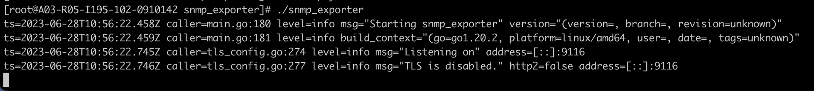


## 6.5 请求数据

```
curl 'http://10.194.195.102:9116/snmp?target=172.20.7.230&module=if_mib'
```


```
ifLinkUpDownTrapEnable{ifAlias="",ifDescr="10GE1/0/6",ifIndex="10",ifName="10GE1/0/6"} 1
ifLinkUpDownTrapEnable{ifAlias="",ifDescr="10GE1/0/7",ifIndex="11",ifName="10GE1/0/7"} 1
ifLinkUpDownTrapEnable{ifAlias="",ifDescr="10GE1/0/8",ifIndex="12",ifName="10GE1/0/8"} 1
ifLinkUpDownTrapEnable{ifAlias="",ifDescr="10GE1/0/9",ifIndex="13",ifName="10GE1/0/9"} 1
ifLinkUpDownTrapEnable{ifAlias="",ifDescr="40GE1/0/1",ifIndex="53",ifName="40GE1/0/1"} 1
ifLinkUpDownTrapEnable{ifAlias="",ifDescr="40GE1/0/2",ifIndex="54",ifName="40GE1/0/2"} 1
ifLinkUpDownTrapEnable{ifAlias="",ifDescr="40GE1/0/3",ifIndex="55",ifName="40GE1/0/3"} 1
ifLinkUpDownTrapEnable{ifAlias="",ifDescr="40GE1/0/4",ifIndex="56",ifName="40GE1/0/4"} 1
ifLinkUpDownTrapEnable{ifAlias="",ifDescr="Eth-Trunk1",ifIndex="60",ifName="Eth-Trunk1"} 1
ifLinkUpDownTrapEnable{ifAlias="",ifDescr="InLoopBack0",ifIndex="3",ifName="InLoopBack0"} 1
ifLinkUpDownTrapEnable{ifAlias="",ifDescr="MEth0/0/0",ifIndex="4",ifName="MEth0/0/0"} 1
ifLinkUpDownTrapEnable{ifAlias="",ifDescr="NULL0",ifIndex="2",ifName="NULL0"} 1
ifLinkUpDownTrapEnable{ifAlias="",ifDescr="Vlanif1000",ifIndex="59",ifName="Vlanif1000"} 1
# HELP ifMtu The size of the largest packet which can be sent/received on the interface, specified in octets - 1.3.6.1.2.1.2.2.1.4
...
```


## 6.6 promethus拉取数据

配置文件设置

```
  - job_name: "Huawei-AC"
    scrape_interval: 15s
    scrape_timeout: 10s
    file_sd_configs: #读取里面targets
      - files:
          - /prometheus/huawei-*.yml # 需要加载的target信息
        refresh_interval: 2m
    metrics_path: /snmp
    relabel_configs:
      - source_labels: [ "__address__" ]
        target_label: __param_target
      - source_labels: [ "__param_target" ]
        target_label: instance
      - target_label: __address__
        replacement: 10.xx.xx.102:9116 # snmp_exporter 服务IP地址
      - source_labels: [ "mib" ] # 从自定义的目标标签获取MIB模块名称
        target_label: __param_module
```


重新启动prometheus

打开prometheus web

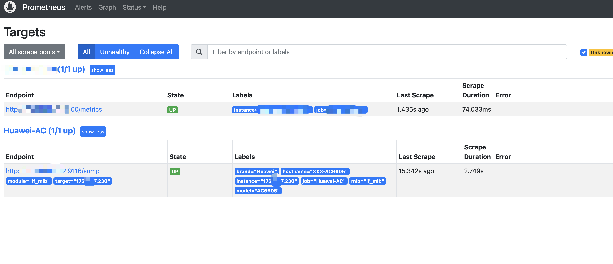


## 6.7 Grafana（2、snmp交换机仪表盘自定义）

上一篇写了安装如下插件，这里写交换机snmp数据的自定义仪表盘。

通用仪表板（AKA SNMP Network）
安装id:15473
https://grafana.com/grafana/dashboards/15473-aka-snmp-network/

华为交换机
安装id:14634
https://grafana.com/grafana/dashboards/14634-snmp/

华三交换机
我根据上面修改适配的，下载json文件导入就行。
[【附件】SNMP_H3C交换机.json.zip](http://localnetwork.cn/media/attachment/2023/02/SNMP_H3C交换机.json.zip)

### 6.7.1变量

| 函数                        | 作用                                                         |
| --------------------------- | ------------------------------------------------------------ |
| label_values(label)         | 返回Promthues所有监控指标中，标签名为label的所有可选值       |
| label_values(metric, label) | 返回Promthues所有监控指标metric中，标签名为label的所有可选值 |
| metrics(metric)             | 返回所有指标名称满足metric定义正则表达式的指标名称           |
| query_result(query)         | 返回prometheus查询语句的查询结果                             |

文档：https://yunlzheng.gitbook.io/prometheus-book/part-ii-prometheus-jin-jie/grafana/templating

参考：
[Grafana Dashboard标签筛选配置（Grafana变量查询配置）](https://blog.csdn.net/shuai_wy/article/details/106982160)

[Grafana Query类型模板变量的使用](https://www.jianshu.com/p/8b2630bf501a)

### 6.7.2 仪表盘自定义

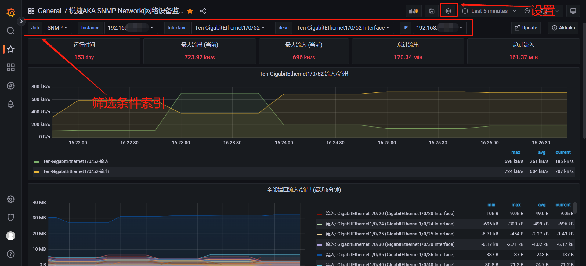
最上面一行的筛选项，是可以自定义的，修改方法：点上图的设置 > Variables（变量)

**增加自定义的筛选项**
label_values(up,instance) #label标签_values值
含义：筛选出处于up状态的服务

**例如，增加名为 IP 的筛选框**
IP == label_values(ifHCInOctets, instance)


在小仪表盘中使用：
$instance 代表 instance项当前选的值


**增加名为 brand 的筛选框**
1.按 [Prometheus（二、用snmp监控）](http://localnetwork.cn/project-10/doc-299/) 的结尾 添加标签的方法，为每各交换机定义名如 brand 的值。

```
- labels:
    mib: HZHUAWEI
    brand: Huawei
    hostname: SH-HJ-HW5720STACK
    model: HWS5720EI
  targets:
    - 192.168.100.1
```

添加变量
brand == label_values(up,brand)
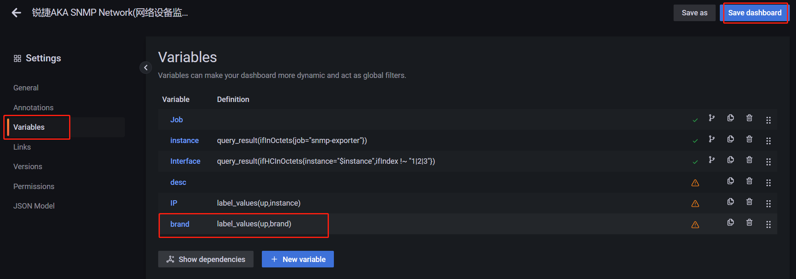

效果
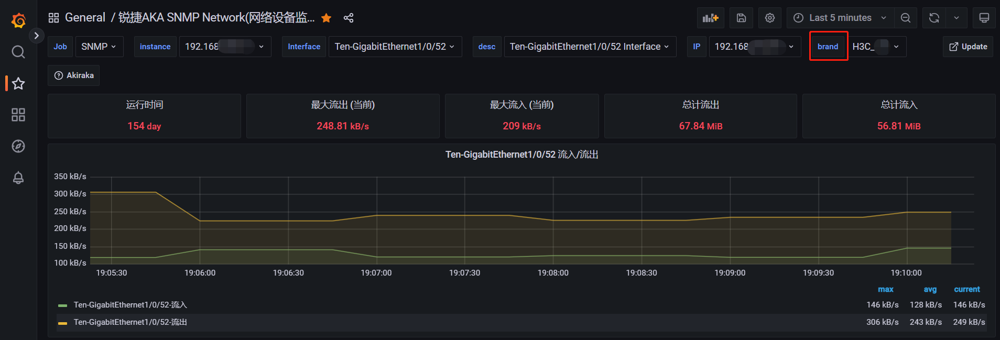

### 6.7.3 变量联动

先选brand值，根据brand值再筛选显示ip
变量设置如下：

```
brand          label_values(up,brand)
ip             label_values(up{brand="$brand"},instance)  #查询表达式，获取变量instance的值

```

### 6.7.4 查找字段含义

在 [Prometheus（二、用snmp监控）](http://localnetwork.cn/project-10/doc-299/)中讲到的 用generator.yml 生成的 **snmp.yml文件**里面自带oid的含义注释。

例如的其中一段：

```
 - name: sysDescr
    oid: 1.3.6.1.2.1.1.1
    type: DisplayString
    help: A textual description of the entity - 1.3.6.1.2.1.1.1#help：实体的文本描述-1.3.6.1.2.1.1.1
  - name: hh3cEntityExtTemperature
    oid: 1.3.6.1.4.1.25506.2.6.1.1.1.1.12
    type: gauge
    help: The temperature for the entity. - 1.3.6.1.4.1.25506.2.6.1.1.1.1.12#help：实体的温度。-1.3.6.1.4.1.25506.2.6.1.1.1.1.12
```

由 snmp.yml文件 得知，代表温度的字段为：hh3cEntityExtTemperature

点击仪表板中图形上的编辑按钮，
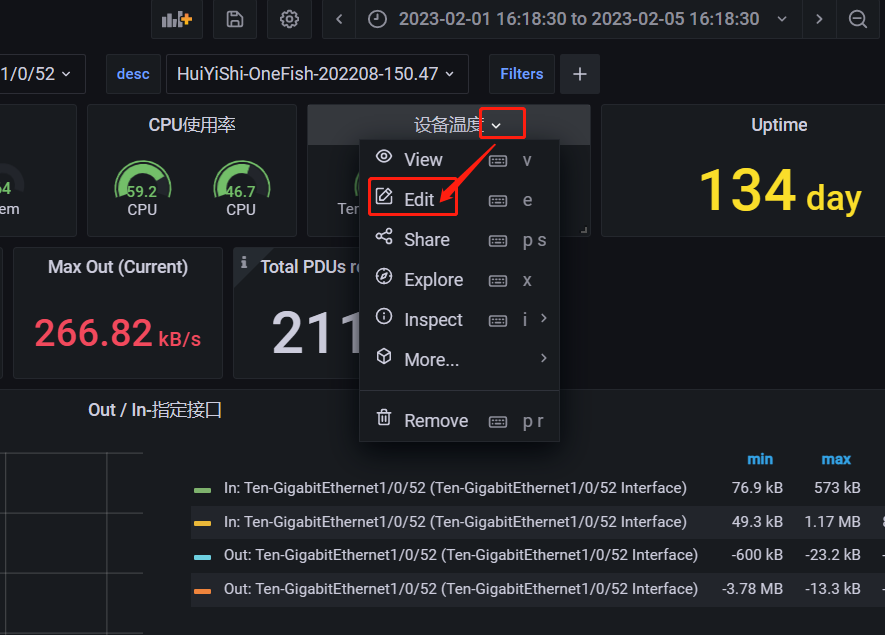
按下图顺序输入字段和筛选项，
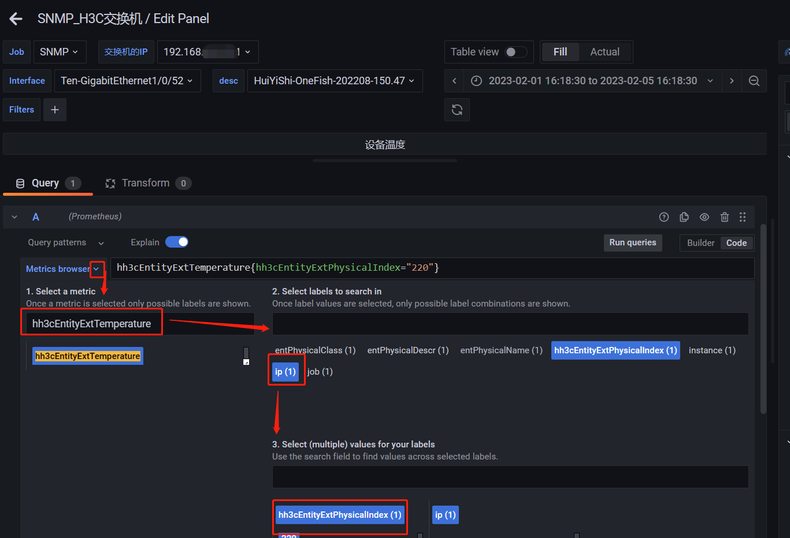
再点最下面的Use query使用查询，温度数据就显示出来了

有多个设备时，需添加筛选ip条件

```
# instance="$IP"
hh3cEntityExtMemUsage{hh3cEntityExtPhysicalIndex="212", instance="$IP"}
```

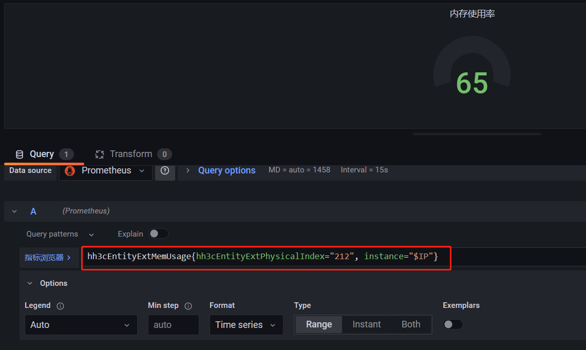

**显示oid下所有内容，获取有用的索引号**

```
# 测试机器获取OID信息snmpwalk -v 2c -c 123456 172.18.48.5 1.3.6.1.4.1.25506.2.6.1.1.1.1.12
```


# 七、prometheus_blackbox


| sum(fail_num) | create_time         |
| ------------- | ------------------- |
| 116           | 2023-06-10 02:18:16 |
| 120           | 2023-06-11 02:18:17 |
| 103           | 2023-06-12 02:18:18 |
| 18            | 2023-06-13 02:18:19 |
| 100           | 2023-06-14 02:18:18 |
| 43            | 2023-06-15 02:18:20 |
| 39            | 2023-06-16 02:18:17 |
| 12            | 2023-06-17 02:18:18 |
| 114           | 2023-06-18 02:18:19 |
| 85            | 2023-06-19 02:18:19 |
| 110           | 2023-06-20 02:18:18 |
| 146           | 2023-06-21 02:27:55 |
| 144           | 2023-06-22 02:28:19 |
| 18            | 2023-06-23 02:18:21 |
| 118           | 2023-06-24 02:18:17 |
| 117           | 2023-06-25 02:18:19 |
| 122           | 2023-06-26 02:18:18 |
| 2             | 2023-06-27 02:08:20 |
| 141           | 2023-06-28 02:28:10 |
| 124           | 2023-06-29 02:18:13 |
| 118           | 2023-06-30 02:18:11 |

